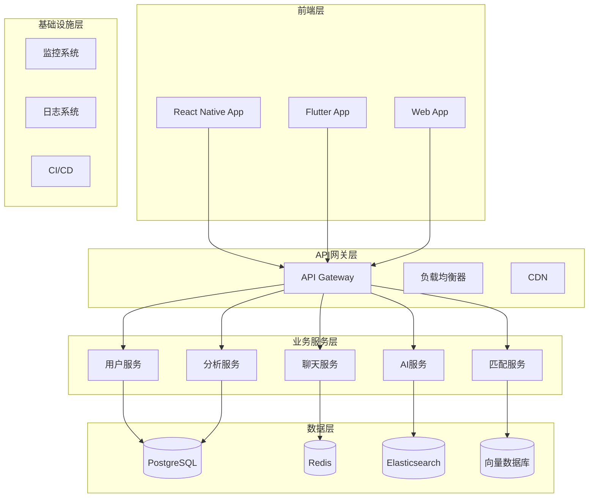
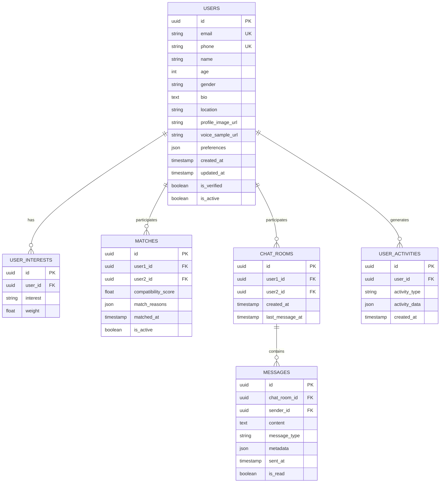

# AI Friend Social Platform - 完整技术架构与实现方案

## 项目概述
基于用户增长的技术栈解决方案比较与优化策略

### 核心目标
1. **快速获客策略** - 从0到1M用户的增长路径
2. **用户留存分析** - 流量分析与老用户维护机制
3. **跨平台兼容** - iOS/Android/Web全平台支持
4. **模块化架构** - 代码重构与迁移策略，Top 3技术栈推荐
5. **成本优化** - 技术成本vs人力成本vs收益vs利润分析

---

## 一、技术栈对比分析

### 方案对比矩阵

| 技术栈方案 | 开发速度 | 扩展性 | AI集成 | 成本效益 | 跨平台性 | 推荐阶段 |
|------------|----------|--------|--------|----------|----------|----------|
| **React Native + Firebase** | ⭐⭐⭐⭐⭐ | ⭐⭐ | ⭐⭐ | ⭐⭐⭐ | ⭐⭐⭐⭐ | 0-50K用户 |
| **Flutter + Go/FastAPI** | ⭐⭐⭐ | ⭐⭐⭐⭐ | ⭐⭐⭐⭐⭐ | ⭐⭐⭐⭐ | ⭐⭐⭐⭐⭐ | 50K-1M用户 |
| **Serverless + AWS** | ⭐⭐⭐⭐ | ⭐⭐⭐⭐⭐ | ⭐⭐⭐ | ⭐⭐⭐⭐⭐ | ⭐⭐⭐ | 1M+用户 |

### 详细技术栈配置

#### 方案一：快速MVP (0-50K用户)
```yaml
前端: React Native (Expo)
后端: Node.js + Express + Firebase
数据库: Firestore (NoSQL)
AI/ML: TensorFlow.js + Hugging Face
认证: Firebase Auth
存储: Firebase Storage
分析: Firebase Analytics + Mixpanel
部署: Vercel + Firebase Hosting
```

#### 方案二：成长阶段 (50K-1M用户)
```yaml
前端: Flutter 3.0+
后端: Go (Gin) + Python (FastAPI)
数据库: PostgreSQL + Redis + Elasticsearch
AI/ML: PyTorch + Transformers + AWS SageMaker
认证: Auth0 + JWT
存储: AWS S3 + CloudFront
分析: Elastic Stack + Apache Kafka
部署: Docker + Kubernetes + AWS EKS
```

#### 方案三：企业级 (1M+用户)
```yaml
前端: React/Next.js + Native (Kotlin/Swift)
后端: Go + Rust + Python微服务
数据库: CockroachDB + Redis Cluster + ClickHouse
AI/ML: 自研LLM + AWS Bedrock + 向量数据库
认证: 自研认证系统 + OAuth2
存储: 多区域CDN + 边缘计算
分析: 实时数据湖 + Apache Flink
部署: 多云架构 + 服务网格
```

---

## 二、系统架构设计

### 核心模块架构



### 数据库设计 (ER图)



---

## 三、API接口设计

### 核心API端点

#### 用户管理
```http
POST /api/v1/users/register
POST /api/v1/users/login
GET /api/v1/users/profile/{user_id}
PUT /api/v1/users/profile/{user_id}
POST /api/v1/users/upload-avatar
POST /api/v1/users/upload-voice
```

#### AI匹配系统
```http
POST /api/v1/matches/find
GET /api/v1/matches/recommendations
POST /api/v1/matches/like/{match_id}
POST /api/v1/matches/pass/{match_id}
GET /api/v1/matches/mutual/{user_id}
```

#### 聊天系统
```http
POST /api/v1/chat/rooms
GET /api/v1/chat/rooms/{user_id}
POST /api/v1/chat/messages
GET /api/v1/chat/messages/{room_id}
POST /api/v1/chat/typing
```

#### 分析系统
```http
GET /api/v1/analytics/user/{user_id}
GET /api/v1/analytics/matches/{user_id}
GET /api/v1/analytics/engagement
POST /api/v1/analytics/events
```

### API响应格式标准

```json
{
  "success": true,
  "data": {
    // 具体数据
  },
  "message": "操作成功",
  "timestamp": "2024-01-01T00:00:00Z",
  "request_id": "uuid"
}
```

---

## 四、AI匹配算法设计

### 匹配算法架构

```python
class AIMatchingEngine:
    def __init__(self):
        self.user_embedding_model = SentenceTransformer('all-MiniLM-L6-v2')
        self.preference_model = self.load_preference_model()
        self.behavior_model = self.load_behavior_model()
    
    def calculate_compatibility(self, user1, user2):
        # 1. 基础信息匹配
        basic_score = self.basic_matching(user1, user2)
        
        # 2. 兴趣相似度
        interest_score = self.interest_similarity(user1, user2)
        
        # 3. 行为模式分析
        behavior_score = self.behavior_analysis(user1, user2)
        
        # 4. 地理位置因素
        location_score = self.location_factor(user1, user2)
        
        # 5. 加权综合评分
        final_score = (
            basic_score * 0.2 +
            interest_score * 0.4 +
            behavior_score * 0.3 +
            location_score * 0.1
        )
        
        return final_score
    
    def get_recommendations(self, user_id, limit=20):
        user_profile = self.get_user_profile(user_id)
        candidates = self.get_candidate_users(user_id)
        
        scored_candidates = []
        for candidate in candidates:
            score = self.calculate_compatibility(user_profile, candidate)
            scored_candidates.append((candidate, score))
        
        # 排序并返回推荐
        scored_candidates.sort(key=lambda x: x[1], reverse=True)
        return scored_candidates[:limit]
```

### 机器学习模型

```python
# 用户偏好学习模型
class PreferenceLearningModel:
    def __init__(self):
        self.model = CatBoostClassifier()
        self.feature_columns = [
            'age_diff', 'location_distance', 'interest_overlap',
            'activity_compatibility', 'communication_style'
        ]
    
    def train(self, user_interactions):
        # 训练用户偏好模型
        X = self.extract_features(user_interactions)
        y = self.extract_labels(user_interactions)
        self.model.fit(X, y)
    
    def predict_preference(self, user1, user2):
        features = self.extract_user_pair_features(user1, user2)
        return self.model.predict_proba(features)[0][1]
```

---

## 五、成本效益分析

### 开发成本估算

| 阶段 | 开发人员 | 时间(月) | 人力成本 | 基础设施成本 | 总成本 |
|------|----------|----------|----------|--------------|--------|
| MVP (0-10K) | 4人 | 3 | $120K | $5K/月 | $135K |
| 成长 (10K-100K) | 8人 | 6 | $480K | $20K/月 | $600K |
| 扩展 (100K-1M) | 15人 | 12 | $1.8M | $100K/月 | $3M |

### 收入模型

```yaml
免费用户:
  - 基础匹配功能
  - 每日限制10次匹配
  - 基础聊天功能
  
高级用户 ($9.99/月):
  - 无限匹配
  - 高级筛选器
  - 优先推荐
  - 语音消息
  
VIP用户 ($19.99/月):
  - 所有高级功能
  - 专属客服
  - 活动优先参与
  - 数据分析报告
```

### 盈利预测

| 用户规模 | 付费转化率 | 月收入 | 年收入 | 利润率 |
|----------|------------|--------|--------|--------|
| 10K | 5% | $5K | $60K | 20% |
| 100K | 8% | $80K | $960K | 35% |
| 1M | 12% | $1.2M | $14.4M | 45% |

---

## 六、实施路线图

### Phase 1: MVP开发 (3个月)
- [ ] 用户注册登录系统
- [ ] 基础个人资料管理
- [ ] 简单匹配算法
- [ ] 基础聊天功能
- [ ] 移动端APP (React Native)

### Phase 2: 功能完善 (6个月)
- [ ] AI匹配算法优化
- [ ] 语音消息功能
- [ ] 用户行为分析
- [ ] 推荐系统优化
- [ ] 性能优化

### Phase 3: 规模化 (12个月)
- [ ] 微服务架构重构
- [ ] 多区域部署
- [ ] 高级分析功能
- [ ] 企业级安全
- [ ] 国际化支持

### Phase 4: 生态扩展 (18个月)
- [ ] 第三方集成
- [ ] API开放平台
- [ ] 社区功能
- [ ] 游戏化元素
- [ ] 企业解决方案

---

## 七、技术风险与应对

### 主要风险点

1. **AI模型准确性**
   - 风险：匹配质量不佳影响用户体验
   - 应对：A/B测试 + 持续模型优化

2. **系统扩展性**
   - 风险：用户增长导致性能瓶颈
   - 应对：微服务架构 + 自动扩缩容

3. **数据安全**
   - 风险：用户隐私泄露
   - 应对：端到端加密 + GDPR合规

4. **成本控制**
   - 风险：基础设施成本过高
   - 应对：混合云策略 + 资源优化

### 监控指标

```yaml
业务指标:
  - 日活跃用户数 (DAU)
  - 用户留存率 (7天/30天)
  - 匹配成功率
  - 付费转化率
  
技术指标:
  - API响应时间
  - 系统可用性
  - 错误率
  - 数据库性能
  
AI指标:
  - 匹配准确率
  - 用户满意度
  - 模型训练时间
  - 推理延迟
```

---

## 八、开发环境配置

### 本地开发环境

```bash
# 后端环境
python 3.11+
postgresql 15+
redis 7+
elasticsearch 8+

# 前端环境
node.js 18+
react-native 0.72+
flutter 3.10+

# 开发工具
docker & docker-compose
kubectl
helm
```

### 部署配置

```yaml
# docker-compose.yml
version: '3.8'
services:
  api:
    build: ./backend
    ports:
      - "8000:8000"
    environment:
      - DATABASE_URL=postgresql://user:pass@db:5432/social
      - REDIS_URL=redis://redis:6379
    depends_on:
      - db
      - redis
  
  db:
    image: postgres:15
    environment:
      - POSTGRES_DB=social
      - POSTGRES_USER=user
      - POSTGRES_PASSWORD=pass
    volumes:
      - postgres_data:/var/lib/postgresql/data
  
  redis:
    image: redis:7-alpine
    ports:
      - "6379:6379"
  
  elasticsearch:
    image: elasticsearch:8.8.0
    environment:
      - discovery.type=single-node
    ports:
      - "9200:9200"

volumes:
  postgres_data:
```

---

## 九、测试策略

### 测试金字塔

```yaml
单元测试 (70%):
  - 业务逻辑测试
  - API端点测试
  - 数据模型测试
  
集成测试 (20%):
  - 服务间通信测试
  - 数据库集成测试
  - 第三方API测试
  
端到端测试 (10%):
  - 用户流程测试
  - 性能测试
  - 安全测试
```

### 自动化测试

```python
# 示例测试用例
class TestMatchingEngine:
    def test_compatibility_calculation(self):
        user1 = UserProfile(interests=['music', 'travel'])
        user2 = UserProfile(interests=['music', 'food'])
        
        engine = AIMatchingEngine()
        score = engine.calculate_compatibility(user1, user2)
        
        assert 0 <= score <= 1
        assert score > 0.3  # 有共同兴趣应该有较高分数
```

---

## 十、总结与建议

### 推荐技术栈

**第一阶段 (0-50K用户)**: React Native + Firebase
- 快速验证市场
- 最小化开发成本
- 快速迭代能力

**第二阶段 (50K-1M用户)**: Flutter + Go/FastAPI
- 更好的性能表现
- 更强的AI集成能力
- 成本效益优化

**第三阶段 (1M+用户)**: 微服务 + 多云架构
- 企业级扩展性
- 高可用性保证
- 全球化部署

### 关键成功因素

1. **用户体验优先** - 简洁直观的界面设计
2. **AI算法质量** - 持续优化匹配准确性
3. **性能优化** - 快速响应和流畅体验
4. **数据安全** - 严格的隐私保护措施
5. **成本控制** - 合理的资源利用策略

### 下一步行动

1. 完成详细的原型设计文档
2. 建立完整的ER图和数据库设计
3. 搭建开发环境和CI/CD流程
4. 开始MVP开发阶段
5. 建立用户反馈收集机制

---

*本文档将持续更新，反映最新的技术发展和项目进展。*