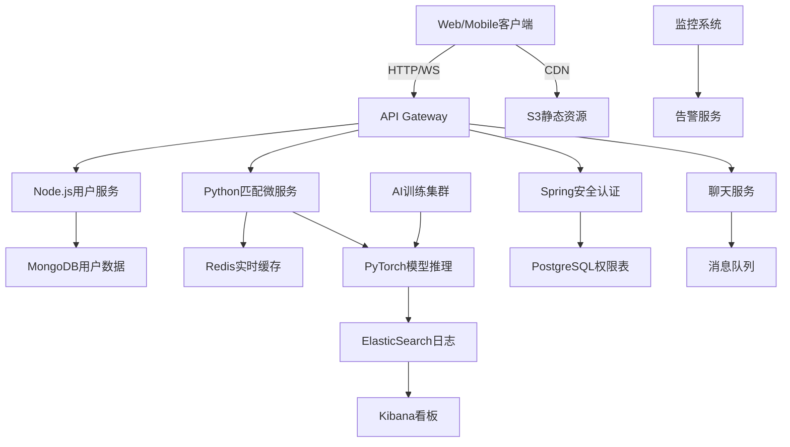

# 社交平台 - 项目架构设计文档

## 📋 1. 项目概述

### Compare technology stack solutions based on user growth 
### 1. How to quickly acquire customers 
### 2. Traffic analysis and maintenance of old users 
### 3. Cross platform 
### 4. Module integration and code refactoring and migration, top 3 technical stack recommendation 
### 5. Technical and human costs vs revenue vs profit, lower the cost optimization profit 

### 项目目标
- 构建智能化的朋友匹配系统
- 提供安全、便捷的社交互动平台
- 实现用户增长与商业价值双赢

### 核心特性
- 🤖 **AI智能匹配** - 基于多维度数据的精准好友推荐
- 🔒 **隐私保护** - 端到端加密，符合国际隐私法规
- 📱 **跨平台支持** - Web、iOS、Android全平台覆盖
- 🚀 **高性能架构** - 支持百万级用户并发访问
- 📊 **数据分析** - 实时用户行为分析和优化建议

---

## 🎯 2. 项目架构要求

### 核心目标
1. **快速获客策略** - 如何快速获取用户
2. **流量分析与用户维护** - 分析流量并维护老用户
3. **跨平台支持** - 多平台兼容性
4. **模块集成与代码重构迁移** - 技术栈推荐与架构优化
5. **成本收益优化** - 技术成本、人力成本与收益平衡

### 项目收益设计
- **平台变现策略** + **用户获取方案** + **用户维护解决方案**

### 商业模式
- 💰 **会员订阅** - 高级功能付费订阅
- 📈 **精准广告** - 基于用户画像的定向广告
- 🤝 **企业服务** - B端API服务和数据洞察
- 🎁 **增值服务** - 虚拟礼物、表情包等

---

## 🏗️ 3. 项目架构设计

### 深入项目需求拆解与系统架构设计
将项目拆解为 **6大核心模块**，从技术栈选择到组件交互逻辑全部采用可扩展设计，满足用户增长需求。

#### **3.1 系统模块分解**

##### 1. **核心功能模块**
- **用户画像与匹配引擎（AI-Driven）**
  - 用户数据存储：结构化（基本信息）与非结构化（兴趣/行为）数据
  - 多模态AI模型：文本语义分析（NLP）、图像处理（如人脸识别）、行为模式训练
- **动态匹配算法**
  - 实时推荐系统：基于协同过滤 + 深度学习（如TensorFlow Recommenders）
  - 数据更新机制：增量学习（Continual Learning）适配用户动态变化
- **互动社交功能**
  - 即时通讯：聊天室/私信（WebSocket + Socket.IO）
  - 社区UGC（User-Generated Content）：帖子/动态/评论管理

##### 2. **跨平台支持**
- **Web端**：React + Next.js（SEO优化）
- **移动端**：React Native（代码复用） + Kotlin/Swift（性能敏感功能）
- **Embedded SDK**：开放API供第三方应用集成

##### 3. **流量与用户运营**
- **用户增长工具**：A/B Test（Optimizely）、病毒式邀请（Branch.io短链）
- **数据分析与留存**：行为日志（Kafka流处理 + ElasticSearch） + 留存策略（Push通知 + AI驱动的个性化提醒）

##### 4. **系统运维与迁移**
- 容器化部署：Kubernetes（混合云兼容性）
- 代码重构工具：SonarQube（技术债分析） + Codemod（自动重构）

##### 5. **安全与隐私保护**
- 数据加密：端到端加密（E2EE）聊天
- 隐私保护：GDPR合规、数据匿名化
- 内容审核：AI + 人工审核机制

##### 6. **监控与告警系统**
- 性能监控：APM工具（如New Relic、Datadog）
- 业务监控：用户行为分析、转化漏斗
- 告警系统：多渠道通知（邮件、短信、Slack）

---

## 💻 4. 技术栈推荐

### **4.1 基于用户增长的技术栈推荐 Top 3**

#### **方案1：MERN + Python微服务（平衡型）**
- **适用阶段**：快速启动（MVP）→ 中等规模（DAU 50k）
- **技术栈**：
  - **前端**：React/Next.js（Web） + React Native（Mobile）
  - **后端**：Node.js（Express） + Python微服务（AI模块/Celery异步任务）
  - **数据库**：MongoDB（文档存储） + Redis（实时缓存）
  - **AI**：PyTorch/TensorFlow（自定义模型） + HuggingFace Transformers（NLP）
- **优势**：
  - 开发速度快，JavaScript全栈统一
  - Python微服务独立扩展AI算力，避免Node.js计算瓶颈
  - 社区资源丰富，学习成本低
- **劣势**：
  - MongoDB事务性较弱，需代码补偿逻辑
  - 微服务间通信复杂度增加

#### **方案2：Spring Boot + Flutter（企业级扩展）**
- **适用阶段**：中大规模（DAU 100k+）
- **技术栈**：
  - **前端**：Flutter（跨平台高性能）
  - **后端**：Spring Boot（Java/Kotlin）+ gRPC（微服务通信）
  - **数据库**：PostgreSQL（关系型） + Cassandra（高并发写入）
  - **AI**：Apache Spark ML（大数据训练） + ONNX Runtime（模型部署）
- **优势**：
  - 强事务性、高并发支持，适合金融级SLA
  - Flutter性能接近原生，适合复杂交互
  - 企业级稳定性，适合大规模部署
- **劣势**：
  - 开发周期较长，Java/Kotlin团队成本较高
  - 技术栈复杂度高，维护成本大

#### **方案3：Serverless（JAMstack + AWS Lambda）（极限低成本）**
- **适用阶段**：验证期 → 小规模（DAU <10k）
- **技术栈**：
  - **前端**：Vue/Nuxt.js（静态生成） + AWS Amplify（托管）
  - **后端**：AWS Lambda（Python/Node.js） + DynamoDB（Serverless DB）
  - **AI**：预训练API（如OpenAI/Google Vision） + AWS SageMaker（按需训练）
- **优势**：
  - 零运维成本，按使用付费，初期投入极低
  - 快速迭代，适合试验性功能
  - 自动扩展，无需手动管理基础设施
- **劣势**：
  - 冷启动延迟高，无法支撑高并发峰值
  - 长期成本可能较高，依赖云厂商

---

## 💰 5. 成本收益分析

| 指标 | 方案1（MERN+Python） | 方案2（Spring+Flutter） | 方案3（Serverless） |
|------|---------------------|------------------------|-------------------|
| **初期投入**（开发+运维） | $80k-$120k | $150k-$200k | $30k-$50k |
| **扩展成本**（DAU 100k） | $20k/month | $15k/month | $50k/month（API调用激增） |
| **团队要求** | Full-Stack JS+Python | Java/Kotlin + DevOps | 无专职运维（依赖云厂商） |
| **盈利时间线** | 6-9个月 | 12-18个月 | 3-6个月（但上限低） |
| **适合商业模式** | 订阅+广告 | 企业级服务 | 小规模付费功能 |
| **技术风险** | 中等 | 低 | 高（依赖第三方） |
| **扩展性** | 良好 | 优秀 | 有限 |
| **开发周期** | 4-6个月 | 8-12个月 | 2-3个月 |
| **维护成本** | 中等 | 低 | 高（长期） |

---

## 🔌 6. 接口设计与组件图

### **6.1 REST API关键接口**

#### 用户管理
- `POST /api/auth/register` - 用户注册
- `POST /api/auth/login` - 用户登录
- `GET /api/user/profile` - 获取用户资料
- `PUT /api/user/profile` - 更新用户资料

#### 匹配系统
- `POST /api/match` - 提交用户资料 → 返回匹配列表（带AI评分）
- `GET /api/match/suggestions` - 获取推荐好友
- `POST /api/match/like` - 喜欢某个用户
- `POST /api/match/pass` - 跳过某个用户

#### 社交功能
- `WS /chat/{session_id}` - 实时聊天（消息持久化到MongoDB）
- `POST /api/posts` - 发布动态
- `GET /api/posts` - 获取动态列表
- `POST /api/posts/{id}/comments` - 发表评论

#### 数据分析
- `GET /api/analytics/retention` - 生成用户留存报告（基于ElasticSearch聚合）
- `GET /api/analytics/engagement` - 用户参与度分析
- `GET /api/analytics/matches` - 匹配成功率统计

### **6.2 系统组件图（Mermaid）**



---

## 🗄️ 7. 数据库设计

### **7.1 用户表（Users）**
```sql
CREATE TABLE users (
    id UUID PRIMARY KEY,
    username VARCHAR(50) UNIQUE NOT NULL,
    email VARCHAR(100) UNIQUE NOT NULL,
    password_hash VARCHAR(255) NOT NULL,
    profile_data JSONB,
    preferences JSONB,
    created_at TIMESTAMP DEFAULT NOW(),
    updated_at TIMESTAMP DEFAULT NOW(),
    last_active TIMESTAMP,
    is_verified BOOLEAN DEFAULT FALSE,
    status VARCHAR(20) DEFAULT 'active',
    avatar_url VARCHAR(255),
    bio TEXT,
    location VARCHAR(100),
    interests TEXT[]
);
```

### **7.2 用户兴趣标签表（User_Tags）**
```sql
CREATE TABLE user_tags (
    id UUID PRIMARY KEY,
    user_id UUID REFERENCES users(id),
    tag_name VARCHAR(50) NOT NULL,
    tag_weight DECIMAL(3,2) DEFAULT 1.0,
    created_at TIMESTAMP DEFAULT NOW()
);
```

### **7.3 匹配记录表（Matches）**
```sql
CREATE TABLE matches (
    id UUID PRIMARY KEY,
    user_id UUID REFERENCES users(id),
    matched_user_id UUID REFERENCES users(id),
    match_score DECIMAL(5,2),
    status VARCHAR(20) DEFAULT 'pending',
    created_at TIMESTAMP DEFAULT NOW(),
    updated_at TIMESTAMP DEFAULT NOW(),
    match_reason TEXT,
    compatibility_factors JSONB
);
```

### **7.4 聊天消息表（Messages）**
```sql
CREATE TABLE messages (
    id UUID PRIMARY KEY,
    sender_id UUID REFERENCES users(id),
    receiver_id UUID REFERENCES users(id),
    content TEXT,
    message_type VARCHAR(20) DEFAULT 'text',
    is_read BOOLEAN DEFAULT FALSE,
    created_at TIMESTAMP DEFAULT NOW(),
    encrypted_content TEXT,
    message_status VARCHAR(20) DEFAULT 'sent'
);
```

### **7.5 用户行为日志表（User_Activities）**
```sql
CREATE TABLE user_activities (
    id UUID PRIMARY KEY,
    user_id UUID REFERENCES users(id),
    activity_type VARCHAR(50) NOT NULL,
    activity_data JSONB,
    ip_address INET,
    user_agent TEXT,
    created_at TIMESTAMP DEFAULT NOW()
);
```

---

## 🚀 8. 部署架构

### **8.1 开发环境**
- Docker Compose 本地开发
- 热重载开发服务器
- 本地数据库和缓存

### **8.2 测试环境**
- CI/CD 流水线（GitHub Actions）
- 自动化测试套件
- 性能测试和负载测试

### **8.3 生产环境**
- Kubernetes 集群
- 多区域部署
- 自动扩缩容
- 蓝绿部署策略

---

## 🔒 9. 安全考虑

### **9.1 数据安全**
- 所有敏感数据加密存储
- 传输层使用 TLS 1.3
- 定期安全审计和渗透测试

### **9.2 用户隐私**
- 符合 GDPR 和 CCPA 法规
- 用户数据可导出和删除
- 隐私政策透明化

### **9.3 内容安全**
- AI 内容审核
- 人工审核机制
- 用户举报系统

---

## 📊 10. 监控与运维

### **10.1 应用监控**
- 性能指标（响应时间、吞吐量）
- 错误率和异常监控
- 用户行为分析

### **10.2 基础设施监控**
- 服务器资源使用率
- 数据库性能监控
- 网络流量分析

### **10.3 业务监控**
- 用户增长指标
- 转化漏斗分析
- 收入指标跟踪

---

## 📋 11. 执行建议

### **11.1 阶段一：MVP验证（0-3个月）**
1. **优先选择方案3（Serverless）**：验证市场需求，快速迭代低成本试错
2. **核心功能开发**：用户注册、基础匹配、简单聊天
3. **用户反馈收集**：A/B测试关键功能

### **11.2 阶段二：产品优化（3-9个月）**
1. **用户破万后迁移至方案1**：引入微服务拆解技术债务，用Node.js+Python平衡速度与性能
2. **功能完善**：AI匹配优化、社交功能增强
3. **性能优化**：数据库优化、缓存策略

### **11.3 阶段三：规模化（9-18个月）**
1. **规模化选择方案2**：当需要企业级SLA与高并发（如引入B端合作）时重构底层架构
2. **国际化扩展**：多语言支持、本地化适配
3. **生态建设**：开放API、第三方集成

---

## ⚠️ 12. 风险评估与应对

### **12.1 技术风险**
- **AI模型效果不佳**：准备多种算法备选方案
- **系统性能瓶颈**：提前进行压力测试和优化
- **第三方服务依赖**：建立降级方案和备用服务

### **12.2 业务风险**
- **用户增长缓慢**：调整获客策略和产品定位
- **竞品压力**：持续创新和差异化
- **监管变化**：密切关注相关法规更新

### **12.3 财务风险**
- **成本超支**：严格控制预算，定期成本分析
- **收入不及预期**：多元化收入模式
- **融资困难**：保持现金流健康，寻找战略投资者

---

## 📞 13. 联系方式

- **项目负责人**：[待填写]
- **技术负责人**：[待填写]
- **产品负责人**：[待填写]

### 项目里程碑
- 🎯 **MVP发布** - 2024年Q2
- 🚀 **正式上线** - 2024年Q3
- 📈 **用户破万** - 2024年Q4
- 🌟 **规模化运营** - 2025年Q1

### 技术栈版本
- **前端框架** - React 18+, Next.js 14+
- **移动端** - React Native 0.72+
- **后端服务** - Node.js 18+, Python 3.11+
- **数据库** - PostgreSQL 15+, Redis 7+
- **AI框架** - PyTorch 2.0+, TensorFlow 2.13+

---

## 📄 许可证

本项目采用 [MIT License](LICENSE) 许可证。

---

*最后更新时间：2024年12月*