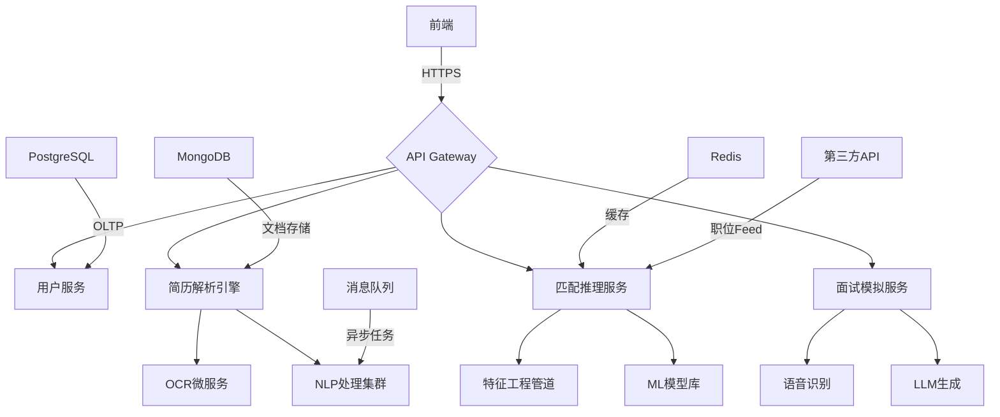

# 项目架构设计

我会将项目拆解如下，并给出详细的技术和架构设计：

### 系统模块拆解
1. 用户认证模块
2. 简历智能解析模块
3. 职位匹配引擎
4. 个性化推荐系统
5. 面试准备引擎
6. 实时通知系统
7. 数据分析仪表盘

### 推荐技术栈
```
├── Frontend: 
│   ├── React + Next.js（SSR支持）
│   ├── TailwindCSS + Headless UI
│   └── WebSocket（实时通信）

├── Backend: 
│   ├── Python FastAPI（REST API）
│   ├── Celery（任务队列）
│   └── Redis（缓存）

├── AI模块: 
│   ├── SpaCy/NLTK（简历解析）
│   ├── Sentence Transformers（语义匹配）
│   ├── XGBoost/LightGBM（推荐系统）
│   └── OpenAI API（面试模拟）

├── 数据库: 
│   ├── PostgreSQL（关系型数据）
│   └── MongoDB（非结构化数据）

├── DevOps: 
│   ├── Docker/Kubernetes
│   └── Prometheus/Grafana（监控）

├── 第三方服务: 
│   ├── Linkedin API
│   └── Indeed API
```

### 页面结构设计
```text
1. 用户仪表盘
   └── 个性化职位推荐瀑布流 (支持Lazy Loading)
   └── 职位匹配进度雷达图
   └── 面试准备车道图

2. 简历分析页面
   └── 可视化技能分布图
   └── 背景提升建议列表
   └── 简历健康度评分

3. 面试模拟页面
   └── AI视频面试录制
   └── 实时反馈仪表盘
   └── 常见问题演练沙盒

4. 企业端管理后台
   └── 候选人匹配矩阵
   └── AI建议审计跟踪
   └── 人才地图热力图
```

### 核心接口设计
```python
# 简历分析接口
POST /api/analyze-resume
Params:
  - resume_file: File
  - preferred_industries: List[str]
Response:
  {
    "skills": {"Python": 0.92, "AI": 0.87},
    "match_score": 82,
    "improvement_suggestions": ["GCP 认证"]
  }

# 职位匹配接口
GET /api/job-matches
Params:
  - user_id: UUID
  - location_preference: str
Response:
  {
    "matches": [
      {
        "job_id": "GOOG-123",
        "title": "ML Engineer",
        "match_reasons": ["NLP经验匹配", "开源项目经历"],
        "fit_score": 0.93
      }
    ]
  }

# 面试模拟接口
WS /api/interview-simulator
Message Flow:
  Client: {type: "start", position: "Data Scientist"}
  Server: {question: "请解释过拟合的解决方案"}
  Client: {audio: <blob>, transcript: "..."}
  Server: {
    feedback: {
      "technical_accuracy": 0.85,
      "speech_clarity": 0.92,
      "improvement": "建议使用Bias-Variance分析框架"
    }
  }
```

### 系统架构图（Mermaid）


### 关键创新点
1. 动态特征工程管道：自动提取跨领域技能描述的同义词映射（如将"spark"映射到"大数据处理"）
2. 解释性匹配系统：生成可审计的匹配理由，符合雇佣公平性原则
3. 混合推荐系统：结合协同过滤（用户行为）和内容过滤（简历特征）
4. 实时模型监控：自动检测特征偏移和模型衰退

### 扩展考量
1. 搭建自动特征商店（Feature Store）保障线上线下特征一致性
2. 设计模型版本灰度更新策略
3. 构建行业知识图谱支持职位关系推理
4. 实施GDPR兼容的数据遗忘机制

是否需要进一步扩展某个模块的详细设计？或者希望调整某个技术选型？