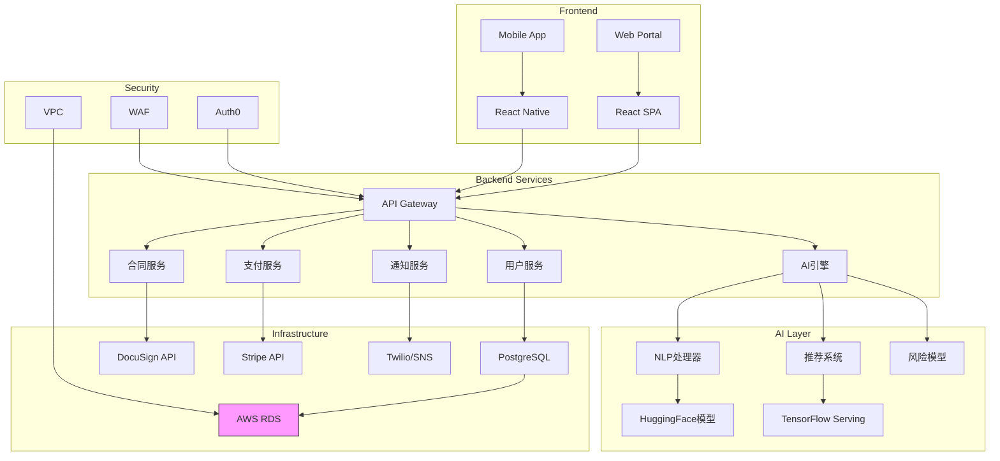

# 项目架构设计

以下是针对AI租赁平台的完整设计方案：

### 一、系统模块划分
1. **用户管理模块**
- 房东/租客双角色系统
- KYC认证体系
- 权限分级管理

2. **智能合同引擎**
- NLP合同解析
- 条款风险扫描
- 电子签名集成（DocuSign）

3. **金融托管系统**
- 押金存管账户
- 自动分账机制
- 租金支付计划引擎
- 担保交易流程

4. **智能推荐系统**
- 租房者偏好分析
- 房源匹配算法
- 信用评分模型

5. **争议解决中心**
- AI仲裁助手
- 沟通留证系统
- 第三方调解接口

6. **数据分析中心**
- 租金市场分析
- 租约趋势预测
- 空置率监控

### 二、技术选型建议

| 领域            | 推荐技术栈                          | 说明                          |
|-----------------|-----------------------------------|-----------------------------|
| 前端框架        | React + TypeScript                | 组件化开发SPA应用               |
| 移动端          | React Native                      | 跨平台开发                     |
| 后端服务        | Java 17 + Spring Boot 3           | 微服务架构基础                  |
| AI核心          | Python + PyTorch + Transformers   | 深度学习模型开发                 |
| 数据库          | PostgreSQL + Redis                | 关系型+缓存组合                |
| 支付网关        | Stripe Connect                    | 支持分账和托管账户               |
| 消息队列        | Apache Kafka                      | 实时通信和事件流处理             |
| 文件存储        | AWS S3 + IPFS                     | 混合存储方案                   |
| 身份验证        | Auth0                             | OAuth2.0和JWT实现              |
| 部署环境        | Kubernetes + Docker               | 容器化集群管理                 |

### 三、系统架构图（Mermaid）



### 四、核心接口设计示例

1. **智能合同生成接口**
```http
POST /api/contracts/generate
Payload:
{
  "landlord_id": "uuid",
  "tenant_id": "uuid",
  "property_id": "uuid",
  "terms": {
    "duration": 12,
    "rent_amount": 2000,
    "deposit": 4000
  }
}

Response:
{
  "contract_id": "uuid",
  "risk_score": 0.15,
  "highlighted_clauses": [
    {
      "clause": "termination",
      "risk_level": "MEDIUM",
      "suggestion": "建议增加30天解约通知条款"
    }
  ]
}
```

2. **支付路由接口**
```http
POST /api/payments/process
Payload:
{
  "user_id": "tenant_uuid",
  "amount": 2000.00,
  "currency": "USD",
  "split_details": [
    {
      "recipient": "landlord_uuid",
      "amount": 1900.00
    },
    {
      "recipient": "platform_uuid",
      "amount": 100.00
    }
  ]
}

Response:
{
  "payment_id": "txn_12345",
  "escrow_balance": 4000.00,
  "next_paymenT_date": "2024-03-01"
}
```

### 五、关键技术创新点

1. **智能合约审核系统**
- 采用BERT变体训练法律合同解析模型
- 建立300+条款的风险评估矩阵
- 自动生成条款修改建议

2. **动态信用评估模型**
- 整合第三方征信数据
- 分析租金支付历史记录
- 生成房东/租客双维度信用评分

3. **AI调解助手**
- 构建法律知识图谱
- 实现自然语言争议点提取
- 生成调解方案建议

### 六、实施路线图

阶段 | 里程碑 | 交付物
---|---|---
1（0-3月） | 核心平台搭建 | MVP版本上线，基础租赁功能
2（4-6月） | 金融系统集成 | 完成押金托管和分账系统
3（7-9月） | AI功能开发 | 合同风险分析上线
4（10-12月） | 市场扩展 | 开放API接口，接入第三方服务

该设计充分考虑了现代SaaS平台的扩展性和合规要求，特别在金融安全方面采取了三层保护机制：支付通道加密、资金存管隔离、交易流水区块链存证。推荐初期采用渐进式架构演进策略，确保系统能快速响应市场需求变化。