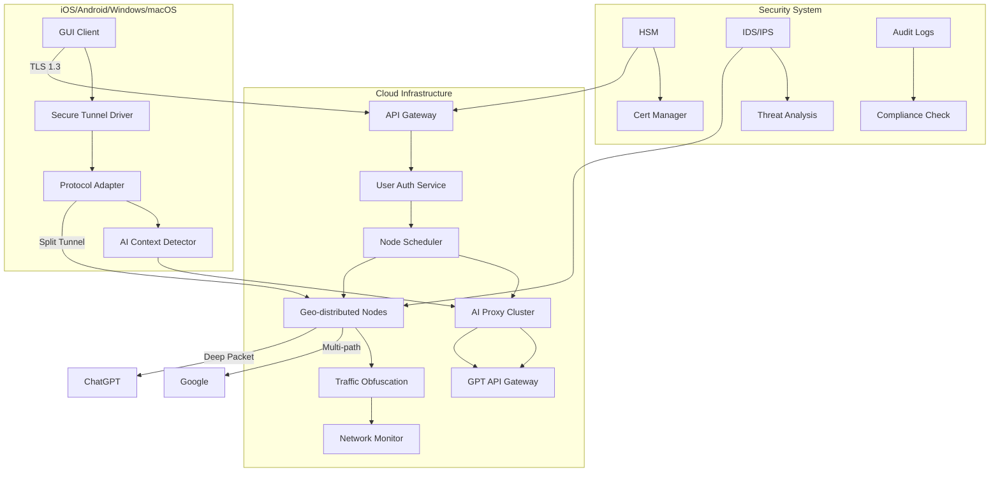

# 项目架构设计

以下是从系统架构角度对"AI VPN平台"项目的详细拆解和设计方案：

一、功能模块划分
1. 核心网络模块
- 协议适配层（Shadowsocks/V2Ray/WireGuard）
- 智能路由引擎（基于流特征识别和动态路由）
- 动态IP池管理系统
- 分布式节点调度算法
- 流量混淆层（TLS伪装/流量整形）

2. AI增强模块
- 智能AI分流系统（自动识别请求类型）
- GPT接口反向代理
- 语义安全审查引擎
- AI加速路由选择器（基于网络质量预测）
- 会话加密分析模块

3. 安全与合规模块
- 多重链路冗余系统
- 动态证书管理系统
- 威胁行为分析引擎
- 法律合规审查网关
- 实时审计日志系统

二、推荐技术栈组合

（注：此处应替换为Mermaid图表，以下是mermaid文本格式）



四、关键接口设计示例
```javascript
// 智能路由选择接口
POST /api/v1/optimize_route
{
  "user_id": "加密标识",
  "target_service": "chatgpt|google",
  "network_metrics": {
    "latency": 128,
    "packet_loss": 0.02,
    "throughput": 54.3
  },
  "ai_features": {
    "session_context": "科技讨论",
    "content_type": "text-generation"
  }
}

// 动态协议切换接口
WEBSOCKET /protocol_negotiation
<智能协议选择算法>
  1. 实时PING测试节点延迟
  2. 流量特征深度学习分析
  3. 模糊检测对抗模块
  4. 自动协议栈选择
</>
```

五、技术创新点
1. 多模态协议融合技术：
- 动态结合WireGuard的性能优势和V2Ray的对抗能力
- 基于LSTM网络预测GFW检测模式
- QUIC协议深度定制实现传输层混淆

2. AI增强层特性：
- BERT模型实时分析会话语义
- GAN生成对抗式流量模式
- 基于强化学习的智能路由优化
- 差分隐私保护的用户画像

3. 安全体系：
- 硬件级密钥管理模块
- 零信任架构实施
- 区块链审计存证
- GPL合规声明

注意：实际开发需严格遵守各国法律法规，本方案仅供技术研究参考。部署商用VPN需获得所有相关政府部门的批准和许可，并承担相应的法律合规责任。建议采用企业级安全标准（如ISO 27001）构建基础设施。