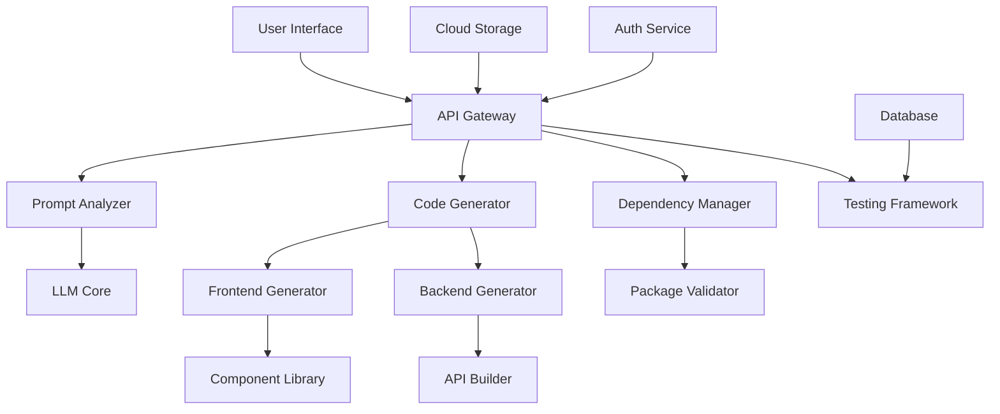

# 项目架构设计

基于您的需求，我将系统拆解为以下模块和设计方案：

### 一、系统架构设计


### 二、模块分解与技术选型

1. **需求理解层**
- **自然语言处理（NLP）模块**
  - 技术：GPT-4/Claude + LangChain
  - 功能：用户意图识别、领域实体抽取、用例提取

2. **架构决策引擎**
- **技术栈选择器**
  - 技术：决策树 + 知识图谱
  - 支持方案：根据需求自动选择MERN（MongoDB/Express/React/Node）或JAMstack等架构

3. **代码生成核心**
- **前端生成器**
  - 技术：React/Vue3 + TypeScript + Prompt engineering
  - 特性：自动生成响应式布局、路由配置、状态管理

- **后端生成器**
  - 技术：Node.js/NestJS + Prisma + OpenAPI
  - 特性：REST/GraphQL自动生成、数据库schema设计

4. **智能联调系统**
  - 容器化环境：Docker + Kubernetes
  - 实时预览：Vite HMR + WebSocket
  - 依赖管理：自动npm/pip版本协调

### 三、核心页面结构设计

1. **生成控制台界面**
```markdown
- 输入面板
  ├─ 需求描述区 (Markdown编辑器增强)
  ├─ 架构选项
  │   ├─ 技术栈预设
  │   ├─ 部署目标选择 (AWS/Vercel/本地)
  │   └─ 扩展插件管理
  └─ 生成控制
     ├─ 即时预览模式
     └─ 渐进式生成模式

- 输出面板
  ├─ 双视图代码编辑器 (VS Code Monaco集成)
  ├─ 实时预览窗口 (iframe沙箱)
  └─ 架构可视化图表
```

### 四、关键接口设计

1. **核心生成接口** `POST /api/v1/generate`
```json
{
  "prompt": "构建一个用户管理系统，需要注册登录、基于角色的权限控制",
  "stack_preference": {
    "frontend": "react-ts",
    "backend": "nodejs",
    "database": "postgresql"
  },
  "quality_level": "production",
  "deployment_target": "aws"
}
```

2. **响应结构**
```json
{
  "project_id": "uuid",
  "structure": {
    "frontend": {
      "components": ["AuthForm", "UserDashboard"],
      "dependencies": ["react-router-dom@6"]
    },
    "backend": {
      "modules": ["auth", "user"],
      "apis": ["POST /api/login", "GET /api/users"]
    }
  },
  "preview_url": "https://sandbox.example.com/preview/uuid",
  "download_url": "https://api.example.com/download/uuid"
}
```

### 五、核心技术支撑方案

1. **多阶段生成机制**
- 第一阶段：通过LLM生成OpenAPI规范
- 第二阶段：基于规范生成代码桩
- 第三阶段：填充业务逻辑并加入测试用例

2. **异常处理策略**
- 实时静态分析：ESLint/TypeScript类型检查
- 运行时沙箱：WebAssembly隔离环境
- AI自动纠错：代码补丁建议生成

3. **竞争力增强要素**
- Feature Store：可复用模块集市
- Architecture Evolution：自动添加监控（Prometheus）、日志（ELK）
- Security Auto-Config：自动配置CSP、CORS、输入校验

这个设计方案平衡了灵活性和规范性，支持从简单原型到生产级应用的生成。是否需要深入某个模块的实现细节？或在某些技术选择上有调整需求？