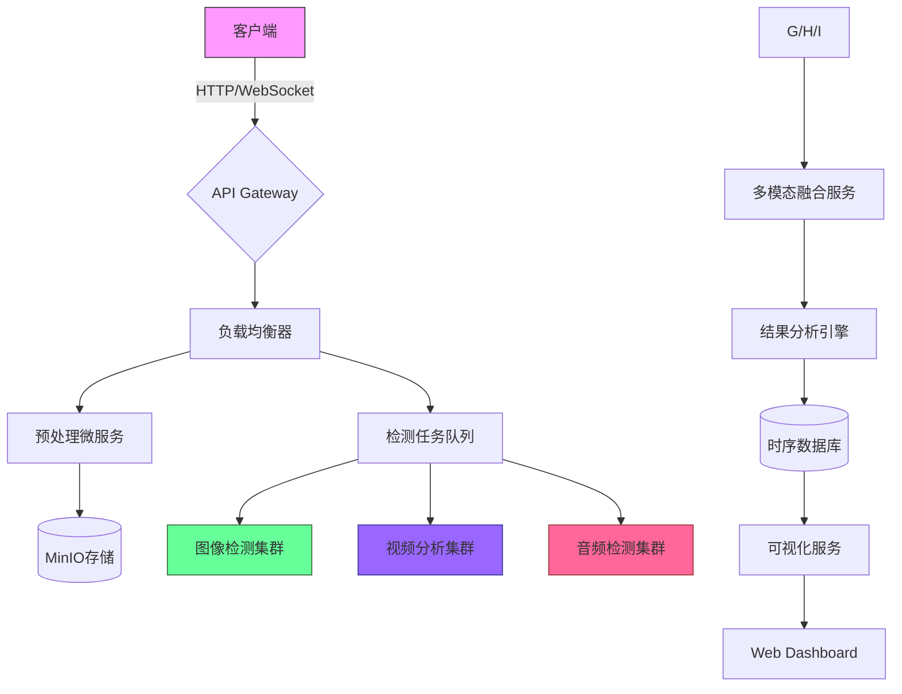

# 项目架构设计

我将从模块设计、技术选型、核心接口、界面结构和系统组件图5个方面为您构建AI深度伪造检测系统：

# 一、系统模块拆分
1. **数据采集与预处理模块**
- 多源输入接口
- 媒体格式转换
- 关键帧/特征提取
- 存储缓存系统

2. **AI检测引擎模块**
- 图像检测模型（CNN/Transformer）
- 视频时序分析子系统
- 音频频谱分析组件
- 多模态融合检测

3. **后处理与结果分析**
- 置信度阈值优化
- 模型可解释性可视化
- 检测报告生成
- 反取证对抗增强

4. **系统管理模块**
- 用户权限管理
- 模型在线更新
- 异常检测告警
- 审计日志系统

# 二、技术栈选型

```markdown
| 模块              | 推荐技术                                                                 |
|-------------------|-------------------------------------------------------------------------|
| **核心框架**       | Python 3.10 + PyTorch 2.0 + ONNX Runtime + FastAPI                      |
| **图像检测**       | Vision Transformer + EfficientNetB7 (预训练模型微调)                   |
| **视频分析**       | 3D-ResNet50 + Temporal Shift Module                                    |
| **音频处理**       | Librosa + CNN1D-BiLSTM                                                 |
| **多模态融合**     | Cross-Modal Transformer + Late Fusion                                  |
| **边缘优化**       | TensorRT量化 + OpenVINO部署                                             |
| **数据管道**       | Apache Kafka + Redis Streams                                           |
| **存储系统**       | MinIO对象存储 + PostgreSQL (带TimescaleDB扩展)                         |
| **Dashboard**      | React + ECharts + WebSocket                                            |
| **DevOps**         | Docker Swarm + Prometheus + Grafana                                    |
```

# 三、接口设计示例

```python
# 检测请求接口
POST /api/v1/detect
{
  "file": "二进制流",  # 支持 multipart/form-data
  "media_type": "video/mp4",
  "priority": "realtime|batch"
}

# 响应协议
{
  "request_id": "UUID4",
  "status": "processing|completed",
  "results": [
    {
      "frame_idx": 1024,
      "timestamp": 34.56,
      "deepfake_score": 0.93,
      "artifact_types": ["face_swap", "lip_sync"],
      "heatmap_url": "s3://..."
    }
  ],
  "confidence": 0.98
}
```

# 四、页面结构规划
```
Dashboard
├── 实时检测面板
│   ├─ 上传区 (拖拽+摄像头接入)
│   ├─ 检测过程可视化 (热力图/频谱图)
├── 历史报告
│   ├─ 时间轴视图
│   ├─ 多维度筛选 (媒体类型/风险等级)
├── 系统监控
│   ├─ 模型性能指标 (TP/FP曲线)
│   ├─ 服务健康状态
└── 管理后台
    ├─ 模型A/B测试
    ├─ 反爬虫规则配置
    ├─ 审计日志查询
```

# 五、Mermaid系统架构图



# 技术创新点
1. **渐进式检测机制**：通过结合粗粒度检测（全帧CNN）和细粒度验证（局部Grad-CAM分析），在保证精度的同时提升检测速度

2. **对抗样本防御**：在预处理阶段集成Anti-Spoofing模块，通过随机数据增强（色彩抖动+频域滤波）增强鲁棒性

3. **在线学习系统**：设计漂移检测机制，当假样本分布变化时自动触发模型增量训练，保持检测效果持续进化

需要进一步讨论模型具体选型或架构细节的环节，欢迎随时提出。