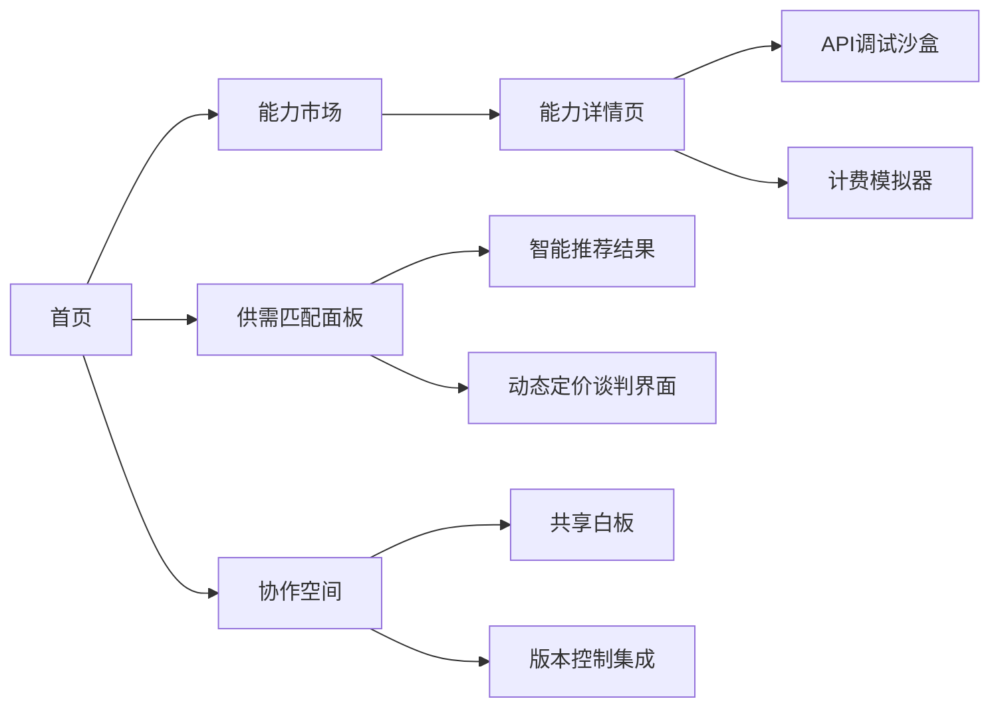
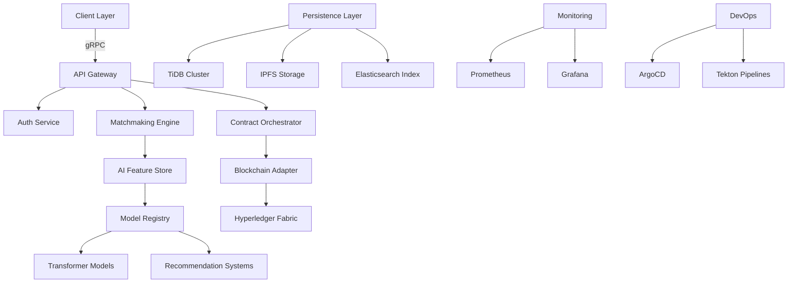

# 项目架构设计

### 项目拆解与设计：AI商业开发平台

---

#### **一、系统模块拆解**
以下是核心模块及其功能说明：

| **模块**                 | **子模块/功能**                                                                 |
|--------------------------|--------------------------------------------------------------------------------|
| **1. 用户与权限**        | 用户注册/登录（多方式）、角色管理（消费者/供应商/管理员）、SSO 集成、用户信用评级模型 |
| **2. 产品/服务管理**     | AI驱动产品发布（自动标签/分类）、供需匹配算法、动态定价推荐、定制化选配模版       |
| **3. 智能交易引擎**      | 合同自动生成（NLP）、履约进度追踪、风险预检系统、智能纠纷仲裁（AI + 规则引擎）   |
| **4. AI 能力中心**       | 多模态能力市场（API/SaaS/模型）、AI Pipeline 编排工具、算力资源调度、算法评估中心 |
| **5. 数据分析与决策**    | 商业洞察看板（动态热力图/趋势预测）、客户意图挖掘、供应链优化建议引擎           |
| **6. 支付与清结算**      | 跨境支付网关、分账规则引擎（智能拆账）、自动对账系统、数字资产账本              |
| **7. 协同生态工具**      | 虚拟协作空间（文档/代码共享）、智能客服中枢、开发者社区知识图谱                 |

---

#### **二、技术栈推荐**
| **领域**              | **推荐技术方案**                                                                         |
|-----------------------|----------------------------------------------------------------------------------------|
| **前端**              | Next.js（SSR优化）+ TailwindCSS + WebSocket（实时通知）+ Three.js（3D产品展示）          |
| **后端**              | Rust（核心交易模块）+ Python FastAPI（AI服务） + GraphQL（灵活数据查询）                 |
| **AI 平台**           | Kubeflow（MLOps）+ Ray（分布式计算） + HuggingFace Transformers（NLP增强）               |
| **数据库**            | TiDB（分布式事务） + Elasticsearch（语义搜索） + Neo4j（关系图谱）                        |
| **基础设施**          | K3s（轻量级K8s） + Istio（服务网格） + AWS Lambda（Serverless 扩展）                     |
| **安全合规**          | OAuth 2.1 + eIDAS 合规框架 + Homomorphic Encryption（敏感数据处理）                      |

---

#### **三、核心页面结构**


---

#### **四、核心接口设计（示例）**
```python
# 1. 智能供需匹配接口
POST /api/v1/matchmaking
Params: 
   - user_id: str（用户画像签名）
   - service_type: str（服务类别加密标识）
Response:
{
   "matches": [{
       "provider_id": "xyz-tokenized",
       "confidence_score": 0.92,
       "dynamic_terms": "智能合约哈希"
   }],
   "nudge_strategy": "差异化定价建议"
}

# 2. AI 能力订阅接口
POST /api/v1/abilities/subscribe
Headers:
   - X-Auth-Token: JWT with OAuth2 scope
Body:
{
   "ability_id": "nlp-translate-v3",
   "billing_model": "pay-per-call",
   "qos_requirements": {
       "latency": "<500ms",
       "throughput": "1000 RPM"
   }
}
```

---

#### **五、系统架构图**


---

#### **六、关键创新点**
1. **价值网络建模**：采用图神经网络构建供需关系图谱，动态预测链路效能损失
2. **隐私增强计算**：在供应链金融场景支持联邦学习+安全多方计算联合建模
3. **智能合约进化**：基于运行时监控数据的契约条件自动迭代（Autonomic Contract）

---

该设计面向高增长赛道，建议采用分阶段实施策略，优先建设核心交易引擎与跨链信任系统。是否需深入探讨监管科技（RegTech）集成方案？