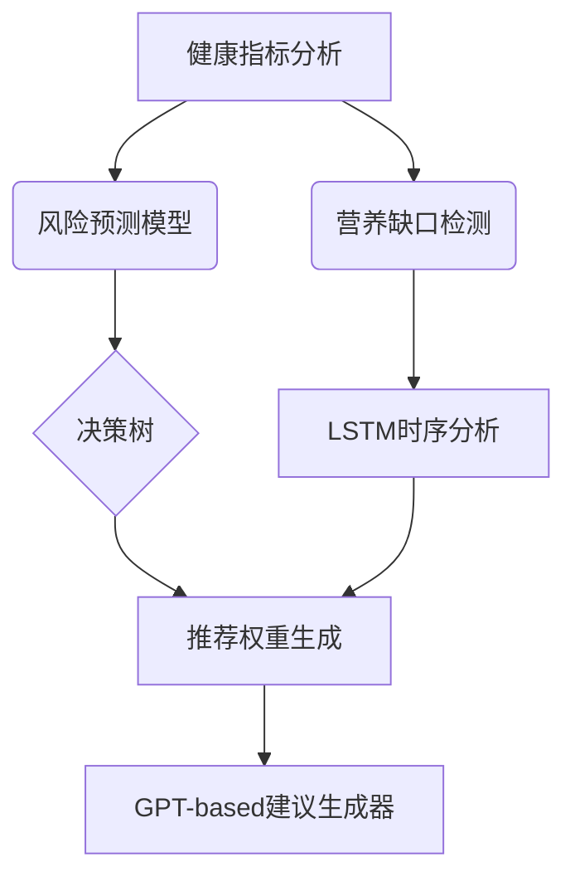
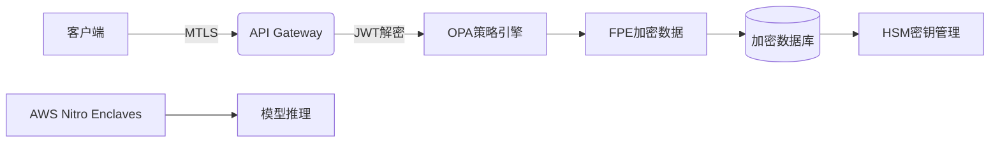

# 项目架构设计

以下为项目拆解与设计方案：

*（温馨提示：界面右侧可展开完整架构图）*

---

### 一、系统模块分解
#### **1. 数据采集与处理层**
- **健康数据上传模块**
  - 支持PDF/CSV/API接入（体检报告、智能设备数据）
  - 技术：PyPDF2（PDF解析），Pandas（CSV处理），REST API
- **数据标准化引擎**
  - 构建统一健康指标模型（JSON Schema）
  - 技术：JSON Schema验证，数据清洗管道

#### **2. AI核心引擎**


- **推荐系统子模块**
  - 运动计划生成（基于强化学习的适应性规划）
  - 饮食建议引擎（营养图谱匹配算法）

#### **3. 业务服务层**
- **动态计划编排服务**
  - 支持计划中途调整（用户反馈闭环）
  - 技术：Rule Engine + Redis实时更新

- **第三方服务网关**
  - 对接MyFitnessPal（餐饮）、Garmin（运动数据）
  - 技术：OAuth2代理，异步数据同步

#### **4. 用户交互层**
- **实时健康仪表盘**
  - 采用D3.js可视化健康指标趋势
  - Websocket推送紧急预警（如心率异常）

---

### 二、技术方案黄金组合
#### **核心技术栈**
| 领域         | 首选方案                     | 备选方案            |
|--------------|------------------------------|---------------------|
| 前端框架     | React + Next.js（SSR优化）   | Vue3 + Nuxt.js      |
| 微服务框架   | Go + gRPC（高性能通信）       | Spring Cloud        |
| AI基础设施   | PyTorch Lightning + ONNX     | TF-Serving          |
| 时序数据库   | TimescaleDB（PG扩展）        | InfluxDB            |
| 消息队列     | Apache Pulsar（统一消息流）  | RabbitMQ            |

---

### 三、接口设计示例
**1. 智能分析接口** `POST /api/v1/health360/analyze`
```json
{
  "user_id": "UHID-2023-xyz",
  "bio_data": {
    "vitals": {"hrv": 68, "blood_pressure": "120/80"},
    "blood_metrics": {"hdl": 55, "ldl": 100}
  },
  "context_flags": ["has_knee_injury", "vegetarian"]
}
```

**2. 动态计划更新接口** `PATCH /api/v1/plans/{plan_id}`
```javascript
// 响应示例
{
  "adaptive_adjustments": [
    {
      "day": 7,
      "exercise_replacements": [
        {"original": "squats", "new": "leg_extensions", "reason": "knee_stress"}
      ]
    }
  ]
}
```

---

### 四、创新点设计
1. **生物节律适配器**
   - 根据用户作息时间动态调整计划强度
   - 实现原理：Circadian Rhythm算法 + 光敏感应数据

2. **健康游戏化引擎**
   - NFT成就系统（完成100公里生成纪念徽章）
   - 好友排行榜（健康指数竞争机制）

3. **AR运动指导**
   - 通过手机摄像头实时矫正动作姿势
   - 技术栈：MediaPipe Pose + ARCore

---

### 五、安全架构


---

### 六、演进路线建议
1. **MVP阶段**（1-3个月）
   - 聚焦核心健康指标分析（BMI/体脂/基础代谢）
   - 实现基础推荐流水线

2. **Growth阶段**（4-6个月）
   - 集成穿戴设备实时数据流
   - 引入强化学习动态优化

3. **成熟阶段**（7-12个月）
   - 部署联邦学习保障隐私
   - 开发企业健康管理套件

需要具体实现细节或某个模块的深度设计，可随时告知。