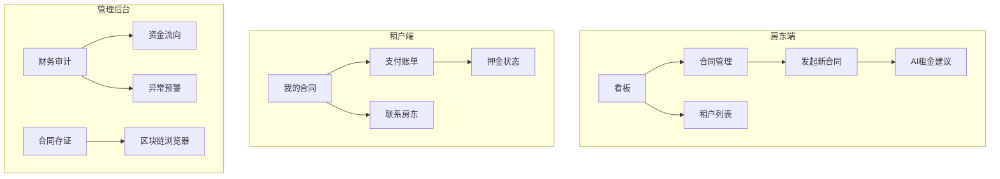
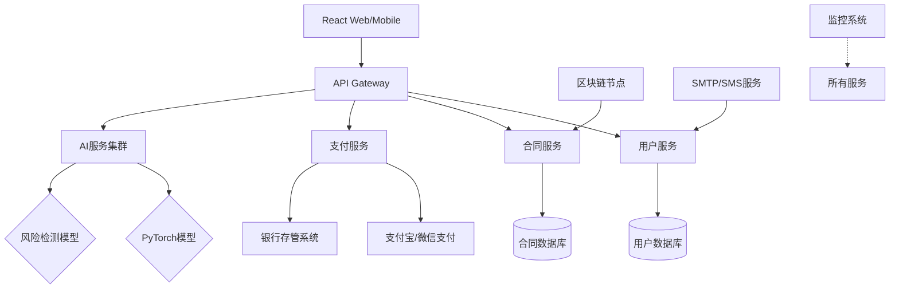

# 项目架构设计

### 一、需求拆解与模块划分

#### **1. 核心功能模块**
| 模块 | 子模块 | 描述 |
|------|--------|------|
| **用户管理** | 用户注册/登录<br>角色权限区分<br>个人信息管理 | - 支持房东、租户、第三方监管机构三类角色<br>- OAuth2/JWT 身份认证<br>- 实名认证与反欺诈检测 |
| **合同管理** | 合同模板生成<br>合同签署流程<br>合同状态跟踪<br>存证与存档 | - 支持AI生成合同条款<br>- 电子签名集成（法律效力）<br>- 区块链存证（可选）|
| **押金与租金管理** | 押金存管<br>租金支付与催缴<br>资金流向审计<br>账单自动化 | - 第三方支付接口（如支付宝/微信/Stripe）<br>- 资金冻结/解冻机制<br>- 智能收据生成 |
| **AI增强模块** | 租金定价建议<br>合同风险评估<br>支付异常检测<br>问答机器人 | - 机器学习市场分析<br>- NLP合同条款审核<br>- 时间序列预测模型 |
| **通知与提醒** | 实时消息推送<br>邮件/SMS通知<br>日历同步 | - WebSocket实时状态更新<br>- 第三方短信/邮件服务集成 |

---

### 二、技术栈推荐
#### **前端**
- **核心框架**: React.js + TypeScript
- **UI库**: Ant Design Pro（企业级中后台UI）
- **支付组件**: 各支付平台官方SDK
- **签名组件**: DocuSign/e签宝嵌入
- **实时通信**: Socket.IO

#### **后端**
- **主框架**: Spring Boot 3（Java 17）
- **认证授权**: Keycloak（IAM解决方案）
- **合同处理**: Python FastAPI微服务（配合Docker）
- **任务队列**: Celery + Redis（异步任务调度）
- **数据库**: PostgreSQL（事务型数据） + MongoDB（日志/行为数据）
- **AI服务**: PyTorch/TensorFlow模型服务化

#### **基础设施**
- **容器化**: Docker + Kubernetes（生产级部署）
- **合规存储**: 阿里云OSS（合同文件存储）
- **监控**: Prometheus + Grafana
- **日志**: ELK Stack

---

### 三、页面结构与接口设计
#### **关键页面示例**


#### **核心接口示例**
```python
# 合同创建接口
POST /api/v1/contracts
Body:
{
  "landlord_id": "uuid",
  "tenant_id": "uuid",
  "property_info": {},
  "ai_suggested_terms": true  # 启用AI条款优化
}

# 押金存管接口
POST /api/v1/deposits
Headers:
  X-Payment-Token: "加密支付令牌"
Body:
{
  "contract_id": "uuid",
  "amount": 3600.00,
  "escrow_type": "首次押金"
}

# AI租金建议接口
GET /api/ai/rent-suggestion?location=上海徐汇&area=85&room_type=两室一厅
Response:
{
  "market_avg": 7500,
  "recommended_range": [7200, 7800],
  "trend_analysis": "过去3个月+2.3%"
}
```

---

### 四、系统架构图


#### **创新点说明**
1. **智能合约执行**: 通过三方签名确认强制触发资金划转
2. **动态租金模型**: 基于LSTM神经网络的时间序列租金预测
3. **合规沙箱**: 隔离第三方支付接口的合规性适配层
4. **区块链存证**: 关键操作上链确保审计溯源性

需要重点注意金融合规性（包括资金存管资质、反洗钱措施）和数据隐私保护（GDPR/个人信息保护法合规）。建议采用微服务架构实现功能解耦，便于后续扩展房产评估等增值服务。