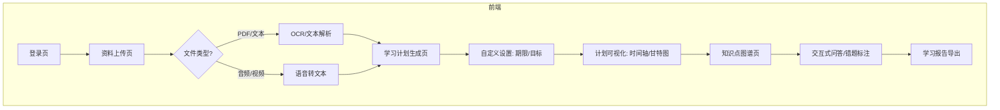
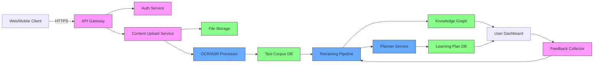

# 项目架构设计

### 一、模块拆解与技术栈推荐

---

#### **1. 核心模块划分**
| 模块名称                    | 功能描述                                       | 推荐技术栈                                                                             |
|--------------------------|--------------------------------------------|-----------------------------------------------------------------------------------|
| **用户模块**                | 用户注册/登录、权限控制、学习偏好设置                      | - 前端：React/Vue.js<br>- 后端：Node.js (Express)/Python (FastAPI)<br>- 认证：JWT/OAuth2.0 |
| **资料处理模块**             | 支持文件上传（PDF/PPT/视频/音频）及格式解析             | - 文件解析：PyMuPDF (PDF)、Whisper (音频)、Tesseract OCR (图片)<br>- 存储：AWS S3/MinIO       |
| **AI分析模块**              | 课程内容结构化提取、知识点识别、知识图谱生成                | - NLP库：HuggingFace Transformers/SpaCy<br>- 知识图谱：Neo4j/NetworkX<br>- LLM：GPT-4/ChatGPT API |
| **学习计划生成模块**           | 根据用户目标（通过率/时间）生成时间表、优先级和推荐路径           | - 推荐算法：基于规则的引擎/协同过滤<br>- 时间规划：递归神经网络（RNN）或条件随机场（CRF）           |
| **知识点总结模块**            | 自动生成章节摘要、概念QA、错题集关联                     | - 文本摘要：BERT/DistilBart<br>- 问答生成：RetroMAE/T5                                        |
| **用户反馈与迭代模块**          | 收集用户学习效果（测验分数/学习时长）、优化AI模型              | - 数据分析：Pandas/NumPy<br>- 模型优化：Scikit-learn/PyTorch                               |

---

#### **2. 关键流程补充**
- **异构数据兼容**：对视频/音频文件的语音转文本（使用Whisper API或PaddleSpeech）
- **知识关系动态更新**：通过GNN（Graph Neural Network）优化知识图谱关联
- **轻量化部署**：前端微服务架构（Next.js + Vercel）+ 后端容器化（Docker + Kubernetes）

---

### 二、页面结构设计（核心功能导图）



---

### 三、接口设计（RESTful API示例）

#### **1. 文件上传与解析**
- **POST** `/api/upload`
  ```json
  Request Body: {
    "file": "课程资料.pdf",
    "target_format": "text"
  }
  Response: {
    "status": "processing",
    "task_id": "abcd1234",
    "parsed_text": "机器学习的三要素是..."  // 若实时返回可能需要流式传输
  }
  ```

#### **2. AI生成学习计划**
- **POST** `/api/plan/generate`
  ```json
  Request Body: {
    "user_id": "user_001",
    "deadline": "2024-12-31",
    "priority": ["神经网络", "概率论"]  // 用户预设优先级
  }
  Response: {
    "plan": [
      {
        "week": 1,
        "topics": ["线性代数基础", "损失函数"],
        "suggested_resources": ["高数教材第3章", "MIT公开课链接"]
      }
    ]
  }
  ```

#### **3. 知识图谱查询**
- **GET** `/api/knowledge_graph`
  ```json
  Params: ?course_id=cs101&depth=2
  Response: {
    "nodes": [
      {"id": "backprop", "label": "反向传播", "type": "algorithm"},
      {"id": "gradient_descent", "label": "梯度下降", "type": "concept"}
    ],
    "edges": [
      {"from": "backprop", "to": "gradient_descent", "label": "依赖"}
    ]
  }
  ```

---

### 四、系统架构图（Mermaid）



---

### 五、技术细节增强
1. **实时性优化**: 使用Redis缓存高频查询结果（如知识图谱节点关系）
2. **容错设计**: 对PDF解析失败自动触发校正流程（例如提示用户手动标注重点）
3. **隐私合规**: 文件脱敏处理（正则表达式过滤身份证/电话号）
4. **多模态扩展**: 未来可集成Stable Diffusion生成概念示意图

这一设计兼顾了技术深度和用户体验扩展性，可依据具体需求迭代开发阶段优先级。