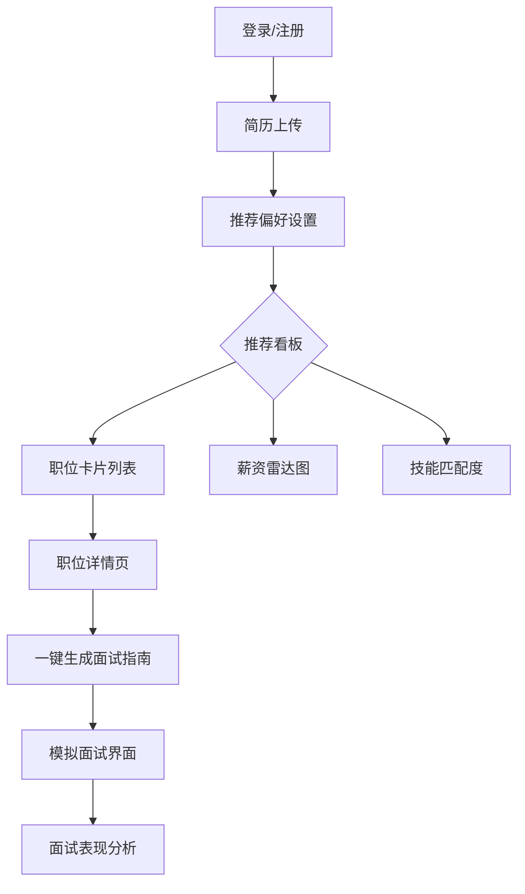
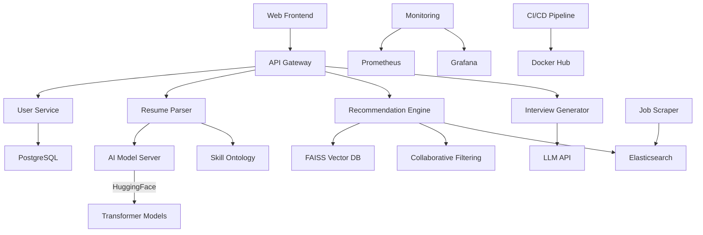

# 项目架构设计

我将从模块拆解、技术栈推荐、页面交互设计、接口设计、系统架构图分步骤说明：

一、系统模块拆解
1. 用户服务模块
- 用户认证（注册/登录）
- 简历管理（云存储/版本管理）
- 偏好设置（行业/地域/薪资过滤）

2. AI简历解析模块
- 多格式解析（PDF/docx/图片）
- 实体识别（NER）架构
- 技能图谱构建
- 语义向量转换

3. 智能推荐引擎
- 职位特征工程
- 协同过滤算法
- 基于内容的推荐
- 冷启动解决方案
- 实时反馈学习

4. 面试增强模块
- 岗位JD分析系统
- 问题生成引擎
- 学习资源关联
- 面试模拟系统
- 进度跟踪面板

5. 管理后台
- 职位数据治理
- 算法监控看板
- 用户行为分析
- 推荐效果AB测试

二、推荐技术栈
1. 核心框架
- 前端：React + Ant Design + TensorFlow.js
- 后端：FastAPI + Celery（异步任务）
- AI框架：PyTorch + HuggingFace Transformers
- 向量数据库：Pinecone/Milvus
- 传统数据库：PostgreSQL（关系型） + MongoDB（文档型）

2. 关键组件选择
- 简历解析：BERT-NER + spaCy pipeline
- 文本向量化：sentence-transformers/all-mpnet-base-v2
- 推荐算法：XGBoost + Faiss（相似度检索）
- 生成模型：GPT-3.5/4 + LangChain（面试内容生成）
- 工作流引擎：Apache Airflow

3. 基础设施
- 云服务：AWS S3（存储） + Lambda（无服务器）
- 容器化：Docker + Kubernetes
- 监控：Prometheus + Grafana
- 日志：ELK Stack

三、页面结构设计
1. 用户操作流：

2. 核心界面要素：
- 简历分析可视化看板（技能地图、经验图谱）
- 三维推荐排序（适配度/薪资/成长性）
- 企业信息口碑聚合展示
- 面试路线图生成器（带时间轴）
- 社区面经对比视图

四、API接口设计
1. 简历处理接口
POST /api/v1/resume/upload
Params: file, user_id
Response: 
{
  "skills": ["Python", "AI"],
  "experience": [{
    "company": "X Corp",
    "duration": "24mo"
  }],
  "embedding": [0.23, ...]
}

2. 智能推荐接口
POST /api/v1/recommendation
Headers: Authorization
Body: {
  "user_id": "uuid",
  "threshold": 0.7,
  "max_results": 20
}
Response:
{
  "jobs": [{
    "id": "JD123",
    "title": "AI Engineer",
    "match_score": 92,
    "salary_range": "$80k-120k",
    "highlight_skills": ["LLM", "PyTorch"]
  }]
}

3. 面试生成接口
POST /api/v1/interview/prepare
Body: {
  "job_id": "JD123",
  "user_id": "uuid",
  "style": "technical" 
}
Response:
{
  "study_plan": [
    {"topic": "System Design", "resources": [...]}
  ],
  "predicted_questions": ["Explain Transformer architecture..."]
}

五、系统架构图

六、扩展设计考量
1. 个性化增强
- 集成LinkedIn数据抓取模块
- 职业路径预测模型
- 薪资谈判指导模块

2. 高级功能
- 基于stable diffusion的虚拟面试官
- 多简历版本对比推荐
- 企业要求差距分析雷达图

3. 数据闭环
- 用户反馈强化学习机制
- 动态特征权重调整
- 岗位需求趋势分析

系统建议采用微服务架构配合事件驱动模式，各AI模块通过gRPC通信。初期可以采用Elasticsearch作为主数据管道，后期逐渐迁移到数据湖架构。