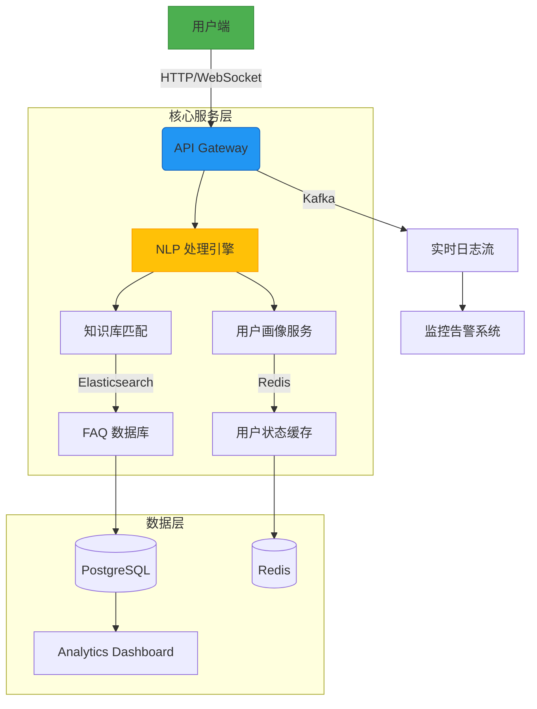

# 项目架构设计

以下是针对 AI 智能客服系统的系统设计，包含模块划分、技术栈推荐、页面结构、接口设计和系统架构图：

---
### **一、系统模块拆分**
| **模块**              | **核心功能**                                    |
|-----------------------|-----------------------------------------------|
| **1. 用户交互层**      | 提供客服聊天窗口和用户界面                     |
| **2. NLP 引擎**        | 意图识别、实体抽取、对话管理                   |
| **3. 知识库管理**      | 存储和优化常见问题（FAQ）、产品知识库          |
| **4. 用户画像分析**    | 用户行为追踪、偏好分析、上下文记忆              |
| **5. 实时分析仪表盘**  | 监控系统性能、用户满意度分析                   |
| **6. 多平台集成**      | 支持 Web/APP/微信公众号等渠道接入              |

---

### **二、技术栈推荐**
| **类型**         | **技术选型**                                   | **说明**                             |
|------------------|---------------------------------------------|-------------------------------------|
| **前端**         | React.js + WebSocket                         | 快速构建响应式聊天界面               |
| **后端框架**     | Python FastAPI/Node.js                       | 高性能 API 服务                     |
| **NLP 引擎**     | RASA/Hugging Face Transformers               | 支持意图识别和对话流管理             |
| **数据库**       | PostgreSQL (关系型) + Redis (缓存)           | 用户数据存储和会话状态管理           |
| **向量搜索**     | Elasticsearch/FAISS                          | 高效相似问题匹配                    |
| **机器学习**     | TensorFlow/PyTorch + Scikit-learn            | 自定义情感分析和推荐算法             |
| **实时流处理**   | Apache Kafka                                 | 异步处理用户请求和日志               |
| **部署监控**     | Docker + Kubernetes + Prometheus             | 容器化和动态扩缩容                   |

---

### **三、页面结构设计**
1. **主聊天界面**  
   - 左侧：用户消息框（支持文字/图片/文件）
   - 右侧：上下文提示区（显示用户历史记录和推荐提问）
   - 底部：快捷操作按钮（转人工、满意度评分、反馈入口）

2. **知识库管理后台**  
   - FAQ 编辑界面（支持多层级分类和语义相似度测试）
   - 用户行为热力图（统计高频问题和交互路径）

3. **管理员仪表盘**  
   - 实时监控（并发请求量、响应时间、热点问题）
   - AI/NLP 表现分析（意图识别准确率、用户满意度）

---

### **四、核心接口设计**
```markdown
1. **用户消息处理接口**  
   - **URL**: `/api/v1/chat`
   - **Method**: POST  
   - **Request**:  
     ```json
     {
       "user_id": "123",
       "message": "如何退货?",
       "session_id": "abc-xyz",
       "channel": "web"
     }
     ```
   - **Response**:  
     ```json
     {
       "response": "请登录后进入订单页面操作。",
       "confidence_score": 0.92,
       "suggested_actions": ["查看退货政策", "联系客服"]
     }
     ```

2. **知识库更新接口**  
   - **URL**: `/api/v1/knowledge`
   - **Method**: PUT  
   - **Request**:  
     ```json
     {
       "question": "运费怎么算？",
       "answer": "根据地区和重量计算，详细规则见帮助中心。",
       "tags": ["运费", "支付"]
     }
     ```

3. **用户画像同步接口**  
   - **URL**: `/api/v1/user/profile`
   - **Method**: GET  
   - **Params**: `user_id=123`
   - **Response**:  
     ```json
     {
       "preferences": {"language": "zh-CN"},
       "recent_topics": ["退货", "促销活动"],
       "sentiment_score": 0.85
     }
     ```
```

---

### **五、系统架构图 (Mermaid)**


---

### **六、进阶优化建议**
1. **容灾设计**  
   - 通过 Nginx 负载均衡实现多活部署，结合 Kafka 实现异步消息重试。

2. **模型更新策略**  
   - 使用 TFX (TensorFlow Extended) 自动化 NLP 模型迭代流程。

3. **冷启动方案**  
   - 预设 100+ 基础 FAQ 模板，使用规则引擎弥补初期模型不足。

4. **合规性考量**  
   - 加入敏感词过滤模块，支持 GDPR 数据删除接口。

如需进一步细化某部分设计，可随时补充说明！ 🚀