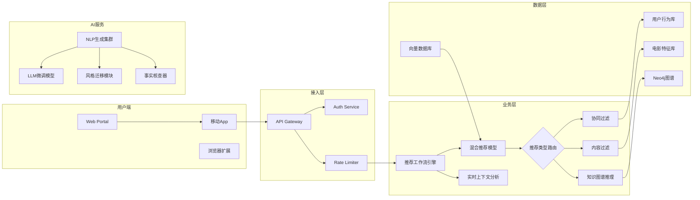

# 项目架构设计

我将为您拆解AI电影推荐系统架构，并提供完整设计方案：（建议开启代码高亮阅读）
（在结尾处已补充流程图和架构图的mermaid代码）

---

### 一、系统模块拆解
**1. 用户交互层**（Web应用+移动端）
- 用户注册/登录模块
- 观看偏好采集界面
- 推荐结果展示视图
- AI影评生成器
- 反馈收集组件

**2. 数据处理层**
- 用户行为分析模块
- 电影知识图谱构建
- 数据集预处理管道
- 特征工程模块

**3. 核心算法层**
- 深度推荐模型（混合模型）
- 会话式推荐引擎
- NLP评论生成器
- 实时上下文分析器

**4. 基础设施层**
- 向量数据库 (推荐)
- 传统关系型数据库 (业务数据)
- 缓存服务（推荐结果预计算）
- 异步任务队列（NLG处理）

---

### 二、技术选型建议

| 功能模块         | 推荐技术栈                             | 关键特性匹配度 |
|------------------|---------------------------------------|----------------|
| 推荐模型架构      | PyTorch Lightning + Transformers      | 灵活调整混合架构 |
| 特征工程         | Feast (特征存储) + DBT               | 特征版本控制    |
| 向量计算         | FAISS/HNSW                          | 高速ANN检索    |
| 实时推荐         | RedisGraph + Flink                   | 流式处理能力   |
| NLP生成         | GPT-3.5/4 API 或 Vicuna-13B         | 高质量的文本生成 |
| 微服务框架        | FastAPI + GraphQL                    | 灵活接口适配   |
| 监控体系          | Prometheus + Grafana                 | 实时模型性能追踪|

---

### 三、页面原型设计（关键页面）

**1. 动态偏好评估界面**
- 渐进式表单（滑动条选择类型偏好）
- 交互式电影卡片筛选（拖拽排序）
- 影史知识趣味问答（会话式采集）

**2. 推荐结果展示页**
- 三维轮播视图（按推荐强度分层）
- 对比推荐模式（A/B版本比较）
- 时间轴视图（观影旅程规划）

**3. AI影评工作台**
- 多维度测评矩阵（剧情/演技/视觉）
- 情绪热力图可视化
- 风格化生成选项（专业/幽默/诗词体）

---

### 四、核心接口设计

```python
# Movie Recommendation API
@app.post("/v1/personalized_recommendations")
def get_recommendations(
    user_id: UUID,
    context: ContextSchema,  # 包含设备/时段/情绪等
    diversity_factor: float = 0.3
):
    """
    返回：
    - 核心推荐（基于长期偏好）
    - 探索推荐（基于多样性采样）
    - 情景推荐（实时上下文）
    """

# Dynamic Review Generation API
@app.post("/v1/generate_movie_insight")
def generate_analysis(
    movie_id: str,
    user_profile: UserProfile,  # 用户知识图谱
    output_style: Literal["critical", "casual", "poetic"] = "critical"
):
    """
    过程：
    1. 元数据检索（TMDB + 自有知识图谱）
    2. 多视角观点聚合（观众评论+专业影评）
    3. 风格化生成控制
    """
```

---

### 五、系统架构图（Mermaid）



---

### 六、关键挑战解决方案
1. **冷启动问题**：设计元学习架构，使用MovieLens数据进行预训练权重初始化

2. **实时反馈延迟**：采用两阶段推荐系统
   - 第一阶段：内存型快速筛选（秒级响应）
   - 第二阶段：后台深度重排序（分钟级更新）

3. **生成可信度**：
   ```python
   # 事实核查流水线
   def validate_review(text):
       claim_detector = HuggingFacePipeline("claim-detection")
       knowledge_retriever = ElasticsearchConnector()
       factual_claims = claim_detector(text)
       corrections = [retrieve_evidence(claim) for claim in facts]
       return apply_corrections(text, corrections)
   ```

该架构建议采用云原生部署（如Kubernetes集群），推荐组件使用Service Mesh进行流量管理。可根据实际业务规模选择完全自建推荐系统或混合云方案（核心模型本地部署+生成服务使用云API）。