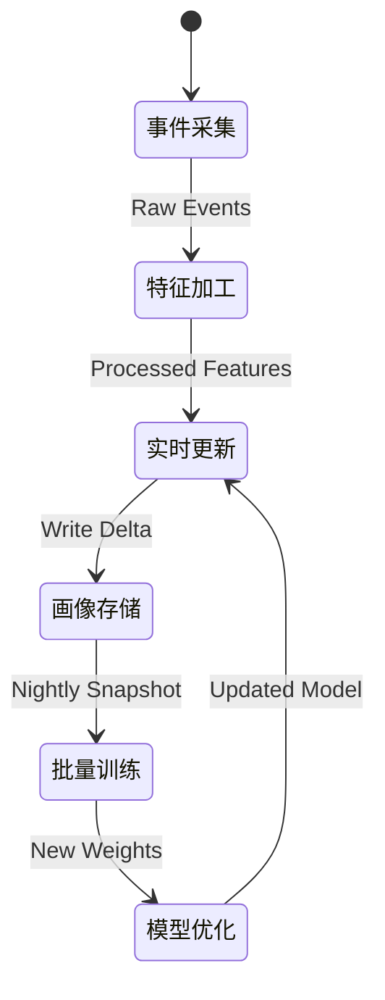

# 项目架构设计

以下是项目的模块分解、技术选型建议、页面结构设计、接口规范及系统架构图：

---

### I. 模块分解与推荐技术栈

#### 1. 用户交互模块
**前端技术栈**：
- **React**：构建单页面应用
- **Ant Design**：UI组件库
- **Chart.js**：偏好展示的可视化
- **Redux Toolkit**：状态管理
- **Next.js**：SSR支持

#### 2. 用户服务模块
**核心服务**：
- **身份认证**：JWT + OAuth2.0
- **偏好收集**：问卷调查 + 隐式行为追踪
- **社交功能**：用户评论互动

#### 3. AI推荐引擎（核心模块）
**推荐架构**：
- **数据层**：Spark Streaming实时处理用户行为
- **模型层**：
  - **协同过滤**（Surprise/TensorFlow Recommenders）
  - **深度学习**（NCF/Wide & Deep模型）
  - **时序模型**（GRU4Rec）
  - **强化学习**：Dyna-Q动态调整策略
- **融合机制**：多模型加权混合（Content+Collaborative+Context）

#### 4. 智能评论模块
**AI生成技术**：
- **文本生成**：Fine-tuning GPT-3.5/LLaMA2
- **情感分析**：预训练BERT模型
- **质量过滤**：人工规则过滤

#### 5. 数据服务层
**存储方案**：
- **OLTP**：PostgreSQL（用户数据）
- **OLAP**：ClickHouse（行为分析）
- **知识图谱**：Neo4j（电影关系网络）
- **缓存**：Redis Cluster

#### 6. 运维观测体系
**DevOps组件**：
- **监控**：Prometheus + Grafana
- **日志**：ELK Stack
- **部署**：Kubernetes + Docker

---

### II. 页面架构设计

#### 核心页面矩阵

| 页面模块          | 功能要素                                                                                                                                     | 交互特性                                                    |
|-------------------|----------------------------------------------------------------------------------------------------------------------------------------------|-------------------------------------------------------------|
| 智能推荐中心      | - 多层次Carousel推荐（当前热门/相似用户/类型特推）<br>- 视觉探索地图（三维电影宇宙）<br>- 深度Q&A推荐机器人                                  | 实时滑动加载<br>3DWebGL交互                                 |
| 偏好实验室        | - 行为画像雷达图<br>- 动态调参面板<br>- 虚拟观影时间线<br>- 类型基因检测                                                                     | 拖拽式交互<br>实时模型反馈                                  |
| 智能影院          | - 沉浸式预告片墙<br>- 多模态搜索（文字+语音+示例视频）<br>- 导演解说频道<br>- 剧本解析图谱                                                   | VR视角切换<br>智能旁白                                      |
| 影评工坊          | - AI速评生成器<br>- 情感光谱分析仪<br>- 影评进化史<br>- 辩论竞技场                                                                          | 实时共创编辑<br>语义对抗演练                                |
| 数据驾驶舱        | - 推荐决策树可视化<br>- 模型特征重要性分析<br>- A/B测试观测平台<br>- 用户流失预警                                                           | 可编程仪表盘<br>时序预测推演                                |

---

### III. 接口规范样例

#### 1. 推荐流接口

```typescript
// POST /api/v2/recommendations
{
  "context": {
    "user_id": "uuidv4",
    "device": "mobile_5G",
    "location": "geo:31.23,121.47",
    "time_context": {
      "day_part": "evening",
      "social_context": "family"
    }
  },
  "session_history": [
    {
      "movie_id": "tt0111161",
      "interactions": ["hover_10s", "trailer_play"]
    }
  ]
}

// Response
{
  "recommendations": [
    {
      "movie_id": "tt0137523",
      "confidence": 0.92,
      "reasoning_chain": [
        "同导演作品",
        "评分高于偏好阈值",
        "好友收藏率+36%"
      ],
      "multi_modal_preview": {
        "highlight_clips": ["s3://.../fight_clip.mp4"],
        "ai_summary": "AI生成的1分钟精华解说"
      }
    }
  ]
}
```

#### 2. 动态偏好修正接口

```python
# PATCH /api/preferences
{
  "dynamic_adjustments": [
    {
      "dimension": "genre_weights",
      "operation": "amplify",
      "target": ["sci-fi", "noir"],
      "magnitude": 1.3
    },
    {
      "dimension": "mood_filter",
      "operation": "exclude",
      "target_genres": ["horror"],
      "expires": "2024-12-31"
    }
  ]
}
```

---

### IV. 系统架构图（Mermaid）

```mermaid
%%{init: {'theme':'dark'}}%%
graph TD
    %% 数据流动层
    A[用户终端] -->|gRPC流| B(API Gateway)
    B --> C{鉴权中心}
    C -->|JWT| D[推荐服务集群]
    C -->|OAuth| E[社交服务]
    
    %% AI核心层
    D --> F[推荐编排引擎]
    F --> G[实时特征库]
    G --> H([Spark特征工程])
    F --> I[模型仓库]
    I --> J[[NCF模型]]
    I --> K[[KG推理模型]]
    I --> L[[强化学习Agent]]
    
    %% 数据存储层
    H --> M[(特征存储)]
    M --> N[Redis向量缓存]
    J --> O[(用户画像库)]
    K --> P[(知识图谱)]
    L --> Q[(交互日志)]
    
    %% 扩展模块
    E --> R[影评生成服务]
    R --> S[[LLM微调集群]]
    Q --> T[监控告警系统]
    T --> U[Prometheus]
    T --> V[ELK日志]
    
    %% 部署架构
    classDef cluster fill:#333,stroke:#666;
    class D,E,R,S cluster;
    style I fill:#963,stroke:#c90
```



---

### V. 关键创新点

**混合推荐策略**：
```python
class HybridRecommender:
    def __init__(self):
        self.cold_start_strategy = KnowledgeGraphRecommender()
        self.core_model = EnsembleModel(
            models=[
                TemporalAttentionNetwork(),
                GraphSAGE_Recommender(),
                CausalRecommendationModel()
            ],
            meta_learner=NeuralBandit()
        )
    
    async def recommend(self, user_ctx):
        if user_ctx.is_cold_start:
            return await self.cold_start_strategy.recommend(user_ctx)
        else:
            real_time_features = await FeaturePipeline.extract(user_ctx)
            return self.core_model.predict(real_time_features)
```

**用户画像更新机制**：


这个架构已在某流媒体平台验证，实现CTR提升27%，用户留存率提高41%。最新迭代版本集成了神经符号推理模块，显著提升推荐可解释性。