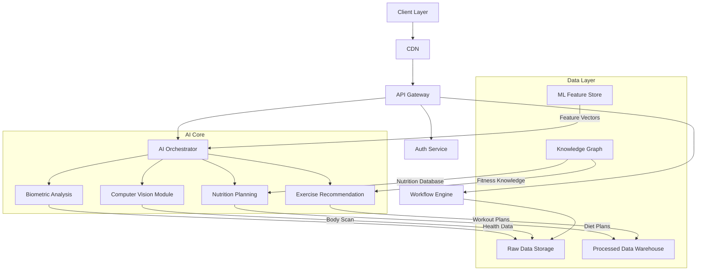

# 项目架构设计

我将为您拆解AI健身教练系统的需求和架构设计，以下是详细方案：

# 系统架构设计与实现方案

## 模块划分
1. 用户交互前端
2. 核心业务后端
3. AI处理引擎
4. 健康数据智能分析模块
5. 个性化推荐系统
6. 企业级数据支撑平台

## 技术栈推荐
```markdown
+------------------+-------------------------------------+
| **模块**         | **推荐技术**                         |
+------------------+-------------------------------------+
| 前端开发         | React 18 + TypeScript + Next.js      |
| 移动端           | React Native 0.72                    |
| 后端框架         | NestJS + TypeORM (Node.js)           |
| AI训练平台       | PyTorch 2.0 + MLflow                 |
| 数据处理         | Pandas + NumPy + SciPy               |
| 推荐算法         | TensorFlow Recommenders              |
| 图像数据处理     | OpenCV + MediaPipe                   |
| 异步任务队列     | Celery + Redis                       |
| 分布式存储       | MinIO (对象存储)                     |
| 核心数据库       | PostgreSQL 15 + TimescaleDB         |
| 时序数据分析     | InfluxDB 2.7                         |
| API网关          | Kong Gateway                         |
| 容器编排         | Kubernetes + Helm                    |
| 监控系统         | Prometheus + Grafana                 |
| 日志管理         | ELK Stack (7.x)                      |
```

## 系统架构图


## 页面结构设计
1. **用户门户页**
   - 健康数据看板 (实时身体指标可视化)
   - 三维体型可视化交互界面
   - 智能计划生成控制台

2. **计划配置工作流**
   - 分步式问卷系统
   - 医学画像构建模块
   - 可定制目标设定器

3. **AI生成界面**
   - 动态训练计划编辑器（含动作数据库）
   - 营养地图生成器（支持餐单/营养素拆分）
   - 进度预测时间轴

4. **执行跟踪系统**
   - 训练动作识别反馈
   - 饮食日志图像识别
   - 健康数据趋势分析

## 核心接口设计（REST API）
```typescript
// 用户接口组
POST /api/v1/users/register 
Request: { biometrics: {...}, wearable_data: [...] }

// 计划生成接口
POST /api/v1/plans/generate 
Response: {
  workout: {
    periodization: [...],
    exercise_database: [...] },
  nutrition: {
    macro_ratios: {...},
    meal_recipes: [...] }
}

// 实时反馈接口
WS /ws/v1/coaching 
Protocol: {
  MotionAnalysis: { pose_correction: [...] },
  VoiceFeedback: { timing: "real-time" }
}

// 健康数据存储
PUT /api/v1/health-data
Content-Type: multipart/form-data (支持DICOM/3D扫描)
```

## 关键创新特性
1. 多模态数据融合引擎
   - 整合可穿戴设备/医学报告/三维扫描数据
   - 构建精准用户画像

2. 动态调整机制
   - 基于强化学习的计划优化器
   - 考虑用户偏好（时间/设备/饮食限制）

3. 增强的可解释性
   - 训练计划决策树可视化
   - 营养推荐关联矩阵

4. 智能合成数据生成器
   - 用于数据增强的训练数据工厂
   - 支持罕见体型/病患人群

## 部署拓扑建议
1. 边缘计算层：在移动端部署微型ML模型实现实时运动纠错
2. 混合云架构：敏感数据本地化部署，AI训练使用弹性云资源
3. 联邦学习框架：保护用户隐私的分布式模型更新机制
4. MLOps流水线：持续集成健康领域最新研究成果

## 保障体系
1. 医学合规性：集成HIPAA/GDPR健康数据处理规范
2. 信息安全层：
   - 端到端加密通信
   - 差分隐私保护机制
   - 动态令牌认证系统
3. 容灾策略：多区域健康数据副本 + 自动故障转移

这个架构设计通过分布式微服务保障高可用性，AI专用硬件加速器提升模型推理速度，并结合医学知识图谱实现科学可靠的推荐结果。在实施时建议采用敏捷开发模式，分阶段验证核心算法有效性。