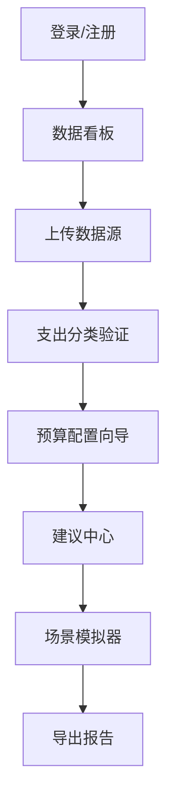
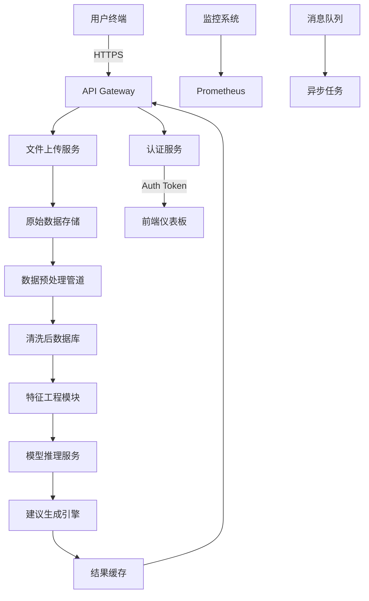

# 项目架构设计

我们将从模块拆解、技术选型、页面设计、API设计和组件图五个方面为您构建AI财务管理系统：

一、系统模块分解
1. 核心功能模块
- 数据整合引擎
  - 银行账单解析器（PDF/CSV/Excel）
  - 人工手动输入接口
  - 第三方API对接组件（信用卡/投资账户）
- AI分析中枢
  - 用户画像构建模块
  - 智能支出分类器（基于交易描述）
  - 消费趋势预测模型（LSTM/Prophet）
  - 风险评估模型（蒙特卡洛模拟）
  - 预算优化算法（线性规划）
- 财务推荐系统
  - 现金流平衡建议引擎
  - 债务优化计算器
  - 储蓄路径规划器
  - 投资组合模拟器

2. 支撑系统模块
- 用户认证网关（支持OAuth2/MFA）
- 实时提醒系统（阈值触发机制）
- 可配置报表生成器（支持自定义时间段）
- API安全中间件（请求签名验证）
- 审计追踪模块（数据变更日志）
- 知识库引擎（FAQs/监管政策）

二、推荐技术栈
- 数据层
  ```markdown
  PostgreSQL（带TimescaleDB时序扩展）
  Redis（缓存热数据）
  MinIO（原始文件存储）
  ```

- 服务层
  ```markdown
  FastAPI（Python 3.10+）
  Celery（异步任务队列）
  MLflow（模型生命周期管理）
  ```

- AI层
  ```markdown
  Scikit-Learn（基础分类）
  TensorFlow Extended（定制模型）
  Spacy（自然语言处理账单描述）
  Optuna（超参数调优）
  ```

- 前端
  ```markdown
  React 18 + Next.js
  Recharts/ApexCharts
  Tailwind CSS
  ```

三、页面架构设计
- 核心页面流


- 关键页面组件
1. 全景仪表盘
   - 现金流环形图
   - 资产分配桑基图
   - 月度对比瀑布图
   - 即时预警面板

2. 智能建议界面
   - 可调节参数滑块
   - 多场景平行对比
   - 实施路线甘特图
   - 风险评估矩阵

四、API接口设计
```python
# 示例FastAPI接口设计
from pydantic import BaseModel
from typing import List

class Transaction(BaseModel):
    date: str
    amount: float
    description: str
    category: str

@app.post("/upload/statement")
async def upload_statement(file: UploadFile):
    """处理金融机构报文"""
    # 文件解析验证逻辑
    return {"status": "processed"}

@app.post("/analyze/cashflow")
async def analyze_cashflow(transactions: List[Transaction]):
    """现金流模式分析"""
    # AI 处理逻辑
    return {"insights": {...}}

@app.get("/reports/{report_type}")
async def generate_report(report_type: str):
    """生成详细财务报告"""
    # 报告生成逻辑
    return FileResponse("report.pdf")
```

五、系统架构图


六、增强型安全机制
1. 数据加密策略
   - TLS 1.3端到端加密
   - AES-256静态数据加密
   - 动态数据脱敏处理

2. 合规性保障
   - GDPR数据主体访问端点
   - PCI DSS支付数据隔离
   - 审计日志不可篡改存储

系统可部署在Kubernetes集群，使用Istio服务网格进行流量管理。建议在开发阶段采用GitLab CI/CD流水线，集成SonarQube进行代码质量检测，并使用OWASP Zap进行安全扫描。

该架构可支持横向扩展，每日处理百万级交易记录。通过预测性自动缩放机制能够根据负载动态调整计算资源，保证在月末等高峰期保持稳定服务。