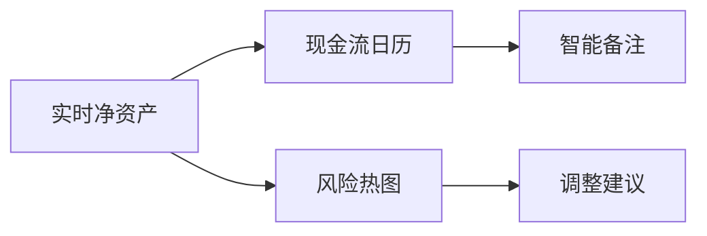
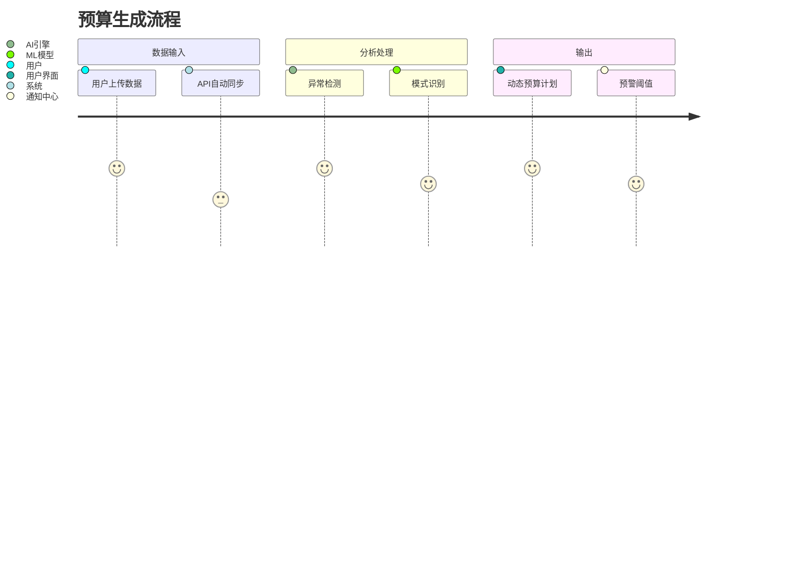
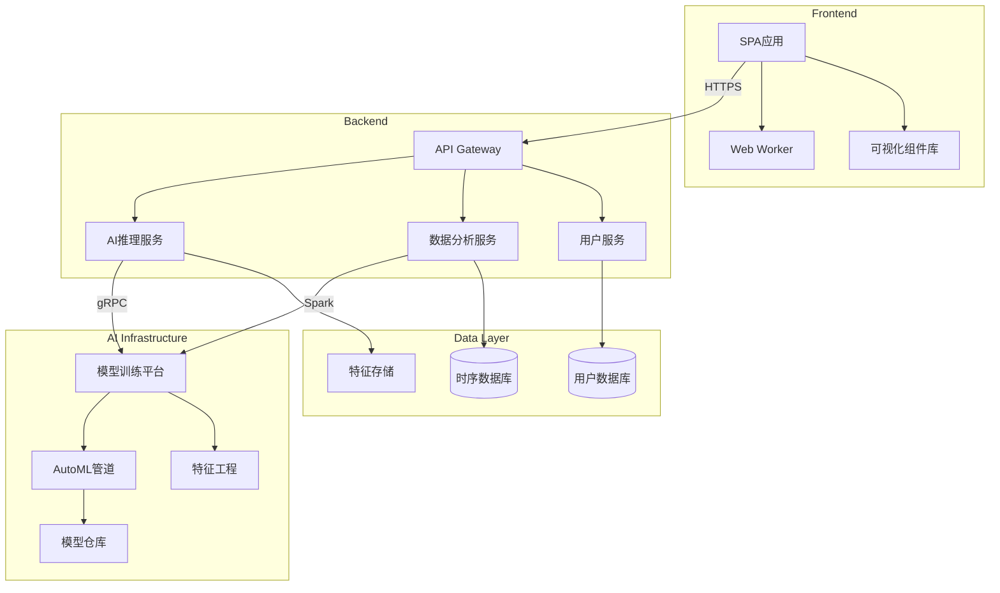

# 项目架构设计

我将为您拆解AI财务管理系统的架构设计，并附上技术方案和系统组件图：

### 一、系统模块拆解
1. **用户管理模块**
- 注册/登录/OAuth集成
- 用户画像分析
- 风险偏好评估

2. **数据采集模块**
- 多格式文档解析（PDF/CSV/Excel）
- 银行API对接
- 账务数据标准化

3. **AI处理核心**
- 消费模式识别系统
- 智能预算生成引擎
- 投资组合优化算法
- 自然语言咨询接口

4. **财务分析模块**
- 现金流预测模型
- 负债优化建议系统
- 税务筹划引擎
- 财务健康度评分

5. **可视化模块**
- 交互式财务仪表盘
- 可视化报表生成器
- 预算执行跟踪看板

6. **安全模块**
- 金融级数据加密
- 合规审计追踪
- 多因素身份验证

### 二、技术栈推荐
**前端技术：**
- Vue3 + TypeScript（主应用）
- D3.js（数据可视化）
- TensorFlow.js（本地预测）
- Web Workers（性能优化）

**后端技术：**
- Python异步框架（FastAPI）
- Apache Kafka（事件流处理）
- Apache Spark（大数据处理）
- PostgreSQL（事务数据）
- TimescaleDB（时序数据）

**AI技术：**
- Hugging Face Transformers（NLP）
- Prophet（时序预测）
- SHAP（模型解释）
- Optuna（超参优化）

**基础设施：**
- K8s集群（服务编排）
- Istio服务网格
- Vault（密钥管理）
- Prometheus + Grafana（监控）

### 三、核心界面设计
**1. 智能仪表盘**


**2. 预算规划工作流**


### 四、核心接口设计
```typescript
// 财务建议接口
interface FinancialAdvice {
  optimalPortfolio: AssetAllocation[];
  debtOptimization: RefinancingPlan;
  taxStrategies: TaxOptimization[];
  riskAssessment: RiskProfile;
  generatedAt: Date;
}

// 预算规划接口
interface BudgetPlan {
  essentialSpending: CategoryBudget[];
  investmentAllocation: InvestmentPlan;
  savingsTargets: SavingGoal[];
  flexibilityScore: number;
  forecastScenario: Forecast[];
}
```

### 五、系统架构图


### 六、扩展性设计
1. **插件架构**：允许第三方接入信用卡、投资平台数据源
2. **策略市场**：金融专家可发布定制化理财策略
3. **模拟沙盒**：虚拟市场环境测试投资策略
4. **监管适配层**：动态加载不同地区的合规规则

### 关键考量点：
1. 金融合规性（GDPR、PCIDSS、SOC2）
2. 模型动态更新（在线学习机制）
3. 解释性AI（符合金融监管要求）
4. 多币种支持（实时汇率处理）
5. 容灾方案（金融级数据保护）

是否需要进一步扩展某个模块的详细设计？或者需要更具体的实现示例？