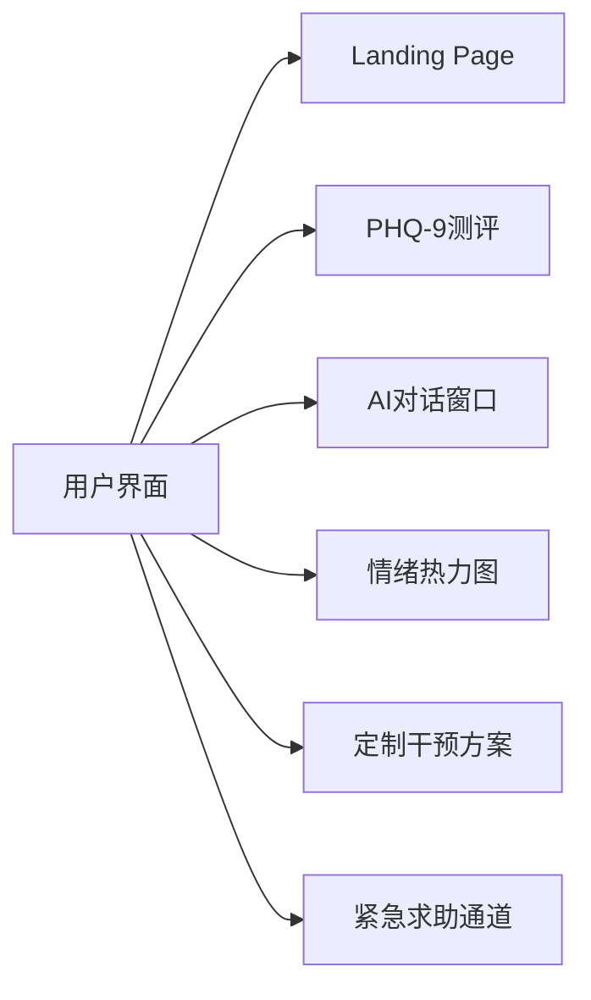
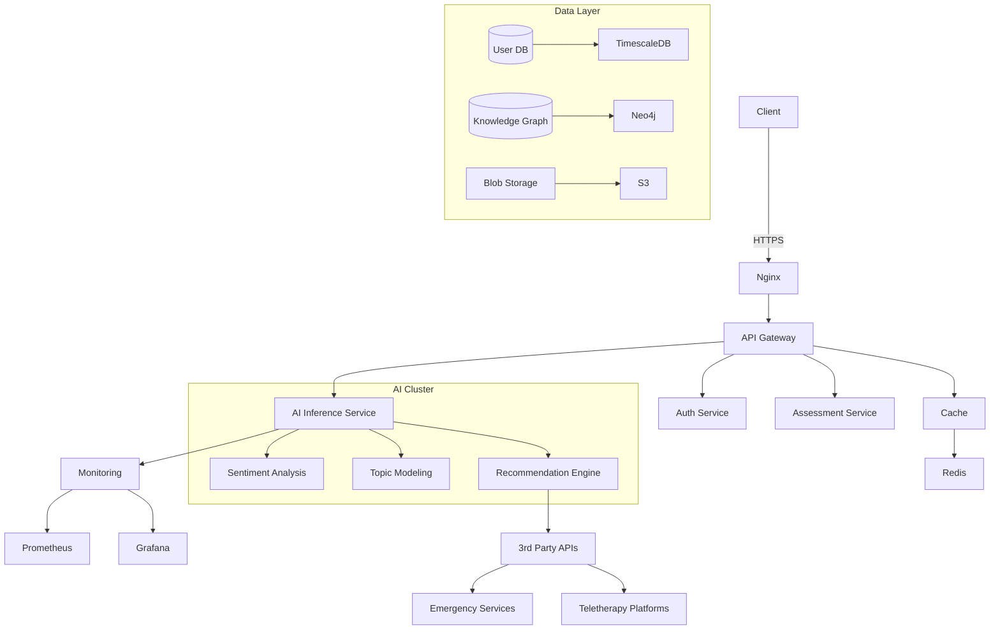

# 项目架构设计

我将为您拆解需求并提供完整设计方案，以下是技术实现规划：

---

### 一、系统模块分解
#### 1. 用户管理模块
- 账户系统（注册/登录）
- 用户画像构建
- 隐私数据加密存储
- 咨询历史记录

#### 2. 心理测评模块
- 动态问卷生成系统
- 多维度评估体系（PHQ-9/GAD-7等）
- 实时评估结果可视化
- 测试进度管理

#### 3. AI核心模块
- 多模态情绪识别（文本/语音）
- 个性化建议生成引擎
- NLP对话管理
- 危机预警系统

#### 4. 资源管理模块
- 心理知识库
- 正念训练课程
- CBT干预方案库
- 应急资源导航

#### 5. 数据分析模块
- 用户行为分析
- 心理健康趋势预测
- 干预效果追踪
- 数据可视化看板

---

### 二、推荐技术栈
#### 前端技术栈
- React + Next.js (SSR)
- Emotion/Styled-components
- WebSocket实时通信
- Chart.js数据可视化

#### 后端技术栈
- Python FastAPI 
- GraphQL + REST混合API
- Redis缓存
- Celery任务队列

#### AI技术栈
- Hugging Face Transformers
- PyTorch情感分析模型
- Dialogflow对话管理
- Weaviate向量数据库

#### 数据库
- PostgreSQL（结构化数据）
- TimescaleDB（时间序列数据）
- S3（多媒体存储）

#### 基础设施
- Docker + Kubernetes
- Prometheus监控
- AWS/GCP云服务
- HIPAA合规存储

---

### 三、界面原型设计
#### 核心页面结构


#### 关键界面要素
1. 动态问卷页面
   - 进度指示器
   - 自适应问题流
   - 多模态输入支持

2. AI咨询面板
   - 情感可视气泡
   - 实时交互反馈
   - 危机级别指示

3. 个人健康中心
   - 情绪变化曲线
   - 干预里程碑
   - 资源推荐卡片

---

### 四、接口设计示例
```python
# 测评结果分析接口
POST /api/v1/assessment/analyze
Params:
{
    "user_id": "UUID",
    "assessment_type": "PHQ-9",
    "responses": [{
        "question_id": 1,
        "answer": 3,
        "response_time": 1200
    }]
}

Response:
{
    "severity_level": "moderate",
    "risk_flag": False,
    "recommendations": [
        {
            "type": "CBT_exercise",
            "intensity": "guided",
            "duration": "2weeks"
        }
    ]
}
```

---

### 五、系统架构图


---

### 六、关键实现考量
1. 伦理安全机制
   - 自杀倾向检测三级响应
   - 本地化LLM微调
   - 解释性AI报告

2. 性能优化
   - 模型蒸馏压缩
   - Edge AI推理
   - 对话状态缓存

3. 合规建设
   - GDPR/HIPAA认证
   - 数据匿名化处理
   - 审计日志系统

---

该方案在保障隐私安全的前提下，构建了包含预防-评估-干预-跟踪的完整服务链。是否需要针对特定用户群体（如青少年/职场人群）进行功能调整？