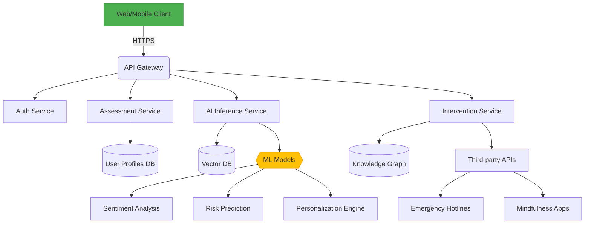

# 项目架构设计

以下是从架构、模块到技术选型的详细拆分方案，并为系统组件和接口设计提供可视化结构：

---

### 一、核心功能模块拆分
1. **用户体系模块**
   - 用户注册/登录（手机/邮箱/OAuth）
   - 心理健康档案建立
   - 权限管理（用户/咨询师/管理员）

2. **动态测评模块**
   - 多维度心理健康量表（PHQ-9、GAD-7等）
   - 动态题目生成算法
   - 作答行为模式分析

3. **AI分析引擎**
   - 文本情感分析（用户文字描述）
   - 测评结果多模态解析
   - 紧急风险等级判定模型

4. **干预策略库**
   - CBT/DBT疗法数字模块化
   - 情景化冥想资源推荐
   - 危机预警与本地化援助对接

5. **成长追踪系统**
   - 情绪变化可视化图表
   - AI复测间隔提醒
   - 干预效果动态评估

---

### 二、技术选型建议
**技术栈** | **模块对应**
---|---
**前端**<br>Next.js + Ant Design + Emotion.js | 所有用户界面
**后端**<br>FastAPI + Celery + Redis | 业务逻辑/异步任务
**AI层**<br>PyTorch + HuggingFace + Rasa | NLP处理与对话
**数据库**<br>PostgreSQL + TimescaleDB | 结构化数据存储
**向量DB**<br>Pinecone | 语义检索增强
**基础设施**<br>Docker + K8s + Prometheus | 容器化与监控

---

### 三、关键接口设计范例
```python
# 测评提交接口
POST /api/v1/assessment
{
  "user_id": "UUID",
  "answers": [
    {"question_id": 12, "response": 3},
    {"question_id": 15, "text": "最近感到压力特别大..."}
  ],
  "metadata": {
    "completion_time": 342,
    "device_type": "mobile"
  }
}

# AI分析结果接口
GET /api/v1/analysis/{session_id}
{
  "risk_level": "moderate",
  "diagnosis_tags": ["焦虑倾向", "睡眠障碍"],
  "recommendations": [
    {
      "type": "CBT_module",
      "content_id": "cbt-202",
      "priority": 1
    }
  ],
  "followup_schedule": "72h"
}
```

---

### 四、系统组件图（Mermaid）


---

### 五、关键技术难点
1. **动态评估优化**：采用蒙特卡洛树搜索（MCTS）实现量表题目动态推荐
2. **隐私保护**：音频/文字数据使用同态加密传输，联邦学习更新AI模型
3. **多模态融合**：结合语言特征、答题时间模式、甚至击键动力学特性综合评估
4. **伦理合规**：通过责任AI框架（IBM AIF360）防止算法偏见

---

整个系统建议采用渐进式架构设计，初期可重点关注：
1. 测评系统准确性与用户体验的平衡
2. AI解读的透明度构建（可解释性报告）
3. 危机识别误报/漏报的调控机制

需要更多细节可说明具体的实施阶段或重点模块。