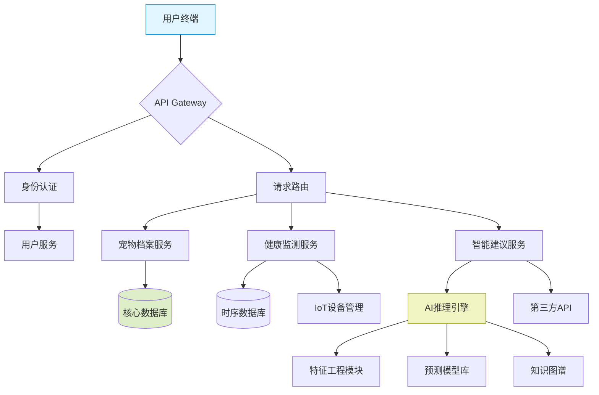

# 项目架构设计

以下是为AI宠物护理系统设计的方案，包含模块拆分、技术栈建议、页面结构、接口设计和系统架构图：

1. 系统模块划分与技术选型

模块名称           | 核心功能                                                                 | 推荐技术栈
------------------|------------------------------------------------------------------------|--------------
1.1 前端模块      | 用户交互、数据展示、预警提醒                                                   | React + Ant Design | React Native | ECharts
1.2 核心服务模块   | 业务逻辑处理、数据分析、系统集成                                                   | Spring Boot/Flask | REST API | PostgreSQL
1.3 AI引擎模块    | 健康预测算法、个性化建议生成、异常检测                                              | Python + TensorFlow/PyTorch | Scikit-learn | FastAPI
1.4 数据存储模块   | 存储宠物档案、健康数据、模型数据                                                  | PostgreSQL | Redis | MinIO
1.5 第三方集成模块 | 对接天气API、兽医系统、IoT设备                                                   | OpenWeatherMap | Twilio | MQTT

2. 核心页面结构与功能

▶️ 首页
- 宠物健康状态概览
- 紧急预警提示
- 快速操作入口

🎯 宠物档案管理
- 添加/编辑宠物信息(品种、年龄、体重、病史)
- 宠物生活习性记录
- 疫苗接种日程管理

🩺 健康监测中心
- 实时数据仪表盘
- 健康趋势分析图表
- 异常指标提醒
- 健康评分体系

💡 智能建议生成
- 日常护理建议（饮食/运动）
- 异常状况处理指导
- 预防性养护方案
- 个性化训练计划

⚙️ 系统设置
- 预警阈值配置
- 第三方服务连接
- 数据导出/导入
- 通知偏好设置

3. 核心接口设计示例

```json
// 宠物健康分析接口
POST /api/v1/pet/analysis
Request:
{
  "pet_id": "PET_202311001",
  "vitals": {
    "heart_rate": 120,
    "temperature": 38.6,
    "activity_level": 0.85
  }
}

Response:
{
  "health_status": "normal",
  "risk_level": 1,
  "suggestions": [
    {
      "type": "exercise",
      "recommendation": "调整运动时间为清晨时段",
      "confidence": 0.92
    }
  ]
}

// 护理方案生成接口
POST /api/v1/care/plan
Request:
{
  "pet_profile": {
    "species": "dog",
    "breed": "Golden Retriever",
    "age": 5,
    "weight": 32
  },
  "environment": {
    "climate": "humid",
    "living_space": "apartment"
  }
}
```

4. 系统架构图 (Mermaid格式)



5. 关键技术实施策略

1) 数据聚合层：
- 构建统一时空数据模型
- 实现多源数据归一化处理
- 开发实时数据流水线

2) 核心算法层：
- 采用GNN处理宠物社交关系
- 应用LSTM进行时序预测
- 集成HMM进行行为模式识别

3) 服务治理：
- 实现自适应流量控制
- 设计故障自愈机制
- 构建灰度发布体系

4) 模型训练：
- 制定迁移学习方案
- 搭建联邦学习框架
- 开发在线学习管道

该系统设计具备良好的可扩展性，可通过以下方式增强：
- 增加智能硬件集成（智能项圈、喂食器等）
- 开发多模态交互（语音/图像识别）
- 引入区块链进行医疗记录存证
- 构建宠物社交网络功能