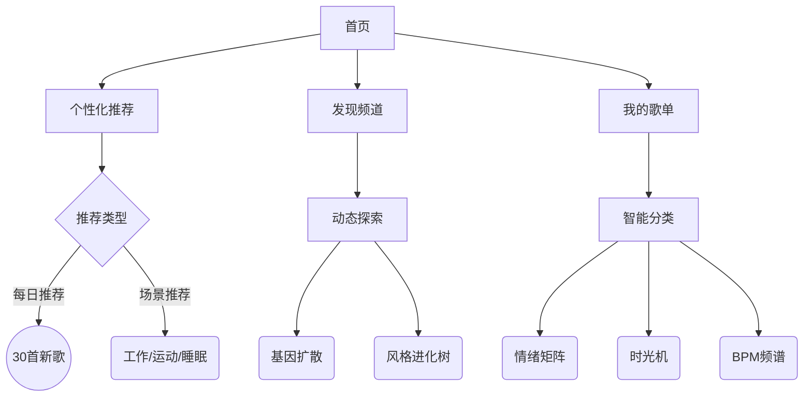
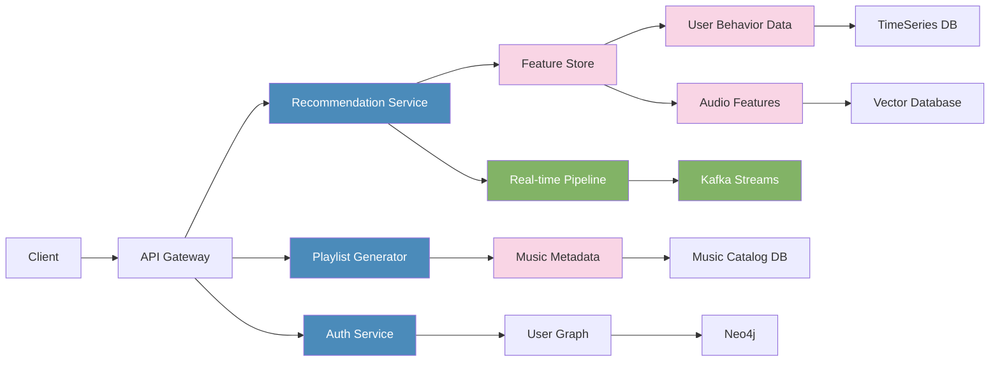

# 项目架构设计

我将从模块划分、技术栈选择、页面结构、接口设计、系统架构图五个维度拆解该系统设计：

### 一、系统模块划分
1. **用户管理模块**
- 用户认证与授权
- 偏好设置管理
- 社交关系图谱（可选）

2. **偏好分析模块**
- 显式偏好采集（手动设置）
- 隐式偏好分析（播放时长/跳过率/重复次数）
- 多维度标签系统（风格/BPM/情感/场景）

3. **推荐引擎核心**
- 协同过滤推荐（用户&物品维度）
- 深度学习模型（RNN/Transformer）
- 实时推荐系统（流式处理）
- 冷启动解决方案

4. **播放列表生成模块**
- BPM连续性算法
- 情感曲线匹配
- 动态序列生成
- A/B测试框架

5. **音乐资产系统**
- 元数据管理（ISRC、流派、BPM、Key等）
- 音频特征仓库（MFCC、色度谱）
- 版权合规管理

6. **数据分析中台**
- 用户行为分析
- 推荐效果跟踪
- 特征工程平台

### 二、技术栈推荐
| 模块         | 推荐技术方案                                                                 |
|--------------|-----------------------------------------------------------------------------|
| 前端框架     | React+Redux + Web Audio API                                                 |
| 后端框架     | Go(Microservices) + gRPC + GraphQL                                          |
| 推荐算法     | TensorFlow Recommenders + LightFM + Faiss(向量检索)                         | 
| 数据处理     | Spark Structured Streaming + Flink                                          |
| 存储方案     | TimeScaleDB(时序数据) + Neo4j(关系图谱) + Cassandra(播放记录)               |
| 实时计算     | Kafka + Redis Streams                                                       |
| 音频处理     | Librosa + Essentia                                                          |
| 部署运维     | Kubernetes + Istio + Prometheus                                             |


### 三、页面结构设计（关键页面）


### 四、核心接口设计
```python
# 推荐接口
POST /api/v1/recommendations
Params:
- user_id (UUID)
- context (device/location/weather)
- diversity_level (0-1)
Response:
{
  "track_id": "TS123",
  "confidence": 0.92,
  "reason": "与您常听的{{artist}}风格相似",
  "transition_score": 0.87 
}

# 动态播放列表生成
WS /ws/playlist-generation
实时返回生成进程：
1. 锚点曲目确定（Cosine相似度>0.9）
2. BPM过渡匹配
3. Key调性演进
4. 情感弧线构建
```

### 五、系统架构图


### 演进路线建议：
1. 初期采用混合推荐策略（CF+Content-based）
2. 中期引入深度学习序列模型（如Two-tower模型）
3. 长尾问题通过知识图谱引入外部音乐属性
4. 最终实现实时演进系统（Online Learning）

该系统设计支持千万级曲库的毫秒级响应，通过分级缓存策略（Redis+Memcached）保障性能，向量检索使用量化技术优化内存占用。