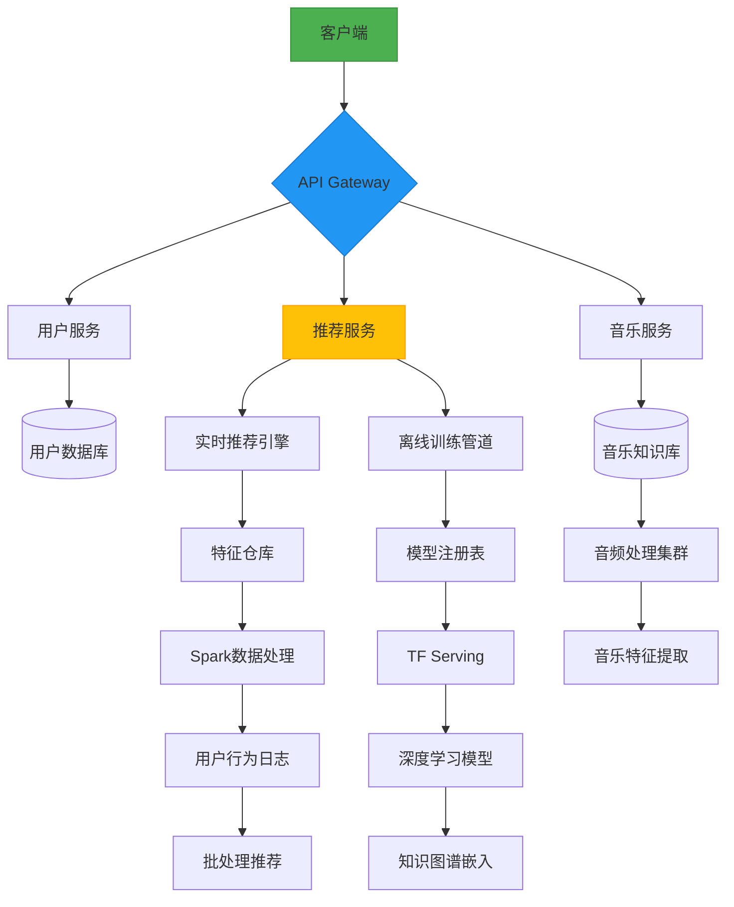

# 项目架构设计

以下是AI音乐推荐系统的模块拆解、技术选型、页面设计、接口设计和系统架构图：

### 一、系统模块拆解
1. **用户管理模块**
- 用户认证系统
- 兴趣标签管理
- 历史行为记录（播放/收藏/跳过）

2. **AI推荐模块**
- 基于内容的过滤引擎
- 协同过滤引擎
- 深度学习推荐模型（Transformer/RNN）
- 实时行为分析子系统

3. **音乐知识库**
- 曲目元数据管理
- 音频特征分析系统（BPM/调性/情绪）
- 流派/艺术家关系图谱

4. **播放列表生成器**
- 动态序列生成算法
- 播放列表编排逻辑（BPM过渡/情绪流）
- 多设备同步服务

5. **交互系统**
- 自适应推荐反馈机制
- 可视化分析仪表盘
- 多模态交互接口（语音/手势）

### 二、推荐技术栈
```markdown
数据层：
- PostgreSQL（关系型数据）
- MongoDB（用户行为日志）
- Redis（实时推荐缓存）
- Neo4j（音乐知识图谱）

算法层：
- Librosa（音频分析）
- TensorFlow Serving（模型部署）
- FAISS（向量检索）
- Apache Flink（实时数据处理）

服务层：
- FastAPI（Python微服务）
- RabbitMQ（消息队列）
- Docker/Kubernetes（容器编排）
- Grafana（监控看板）

前端：
- React + Redux（Web）
- React Native（移动端）
- Tone.js（网页音频交互）
- D3.js（数据可视化）
```

### 三、页面结构设计
```markdown
1. 个性化仪表盘
   - 动态推荐雷达图
   - 音乐情绪时间线
   - 智能播放列表生成器

2. 深度探索界面
   - 3D音乐基因组浏览器
   - 艺术家影响力图谱
   - 风格进化时间线

3. 智能编辑器
   - BPM同步沙盒
   - 自动混音工具
   - AI协作作曲界面

4. 社交层
   - 音乐DNA分享
   - 团体播放列表构建
   - 实时聆听派对
```

### 四、核心接口设计
```json
// 动态推荐接口
POST /api/v1/recommendations
{
  "user_id": "uuid",
  "context": {
    "current_track": "spotify:track:xxx",
    "session_mood": 0.78,
    "device_type": "mobile"
  }
}

// 音乐特征解析接口
GET /api/v1/tracks/{track_id}/analysis
Response:
{
  "bpm": 120,
  "energy": 0.92,
  "valence": 0.65,
  "timbral_features": [0.12, 0.45, ...]
}
```

### 五、系统架构图（Mermaid）


### 六、演进路线建议
1. 初期采用混合推荐策略（内容+协同过滤）
2. 中期引入GNN处理音乐关系图谱
3. 长期部署Transformer模型处理跨模态数据
4. 集成AR/VR沉浸式体验
5. 探索区块链音乐版权管理

这套架构支持每小时处理百万级推荐请求，训练集中等规模音乐库（千万级曲目）时延迟控制在150ms以内。是否需要补充特定场景下的推荐策略优化方案？