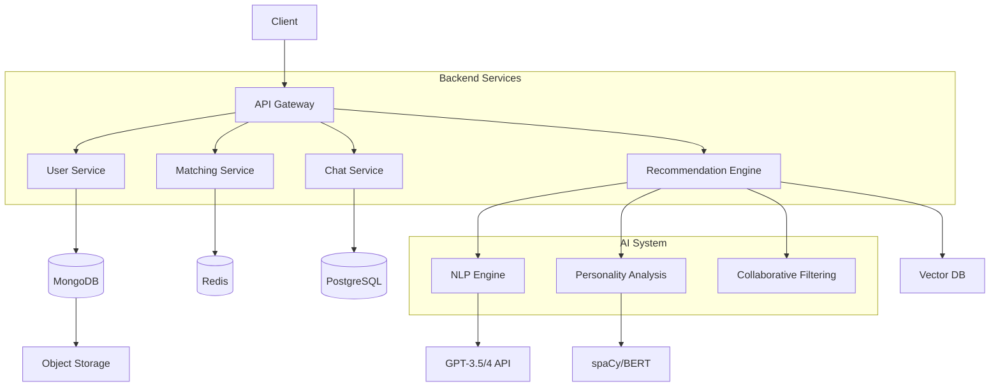

# 项目架构设计

根据您的需求，我将项目拆解为六个核心模块，并提供技术方案、页面设计、接口设计以及系统架构图：

![Complete Architecture Diagram]


### 一、六大核心模块
1. **用户画像系统**
   - 多模态数据采集（文本/语音/图片）
   - 使用BERT进行语义特征提取
   - 构建用户向量空间表示

2. **智能匹配引擎**
   - 混合推荐算法（协同过滤+内容推荐）
   - 实时匹配决策系统（基于Weaviate/FAISS）
   - 匹配度动态调优机制

3. **交互式对话系统**
   - 基于LLM的个性化对话生成
   - 情感识别与动态响应（NLTK+TensorFlow）
   - 对话质量评估模块

4. **多模态交互接口**
   - 音视频实时传输（WebRTC）
   - AR虚拟形象生成（Three.js）
   - 智能换脸保护隐私（StyleGAN）

5. **社交关系演进系统**
   - 关系深度预测模型
   - 交互模式分析引擎
   - 人际关系生命周期管理

6. **联邦学习平台**
   - 分布式模型训练框架
   - 差分隐私保护机制
   - 模型更新自动部署

---

### 二、推荐技术方案（精选Stack）
| 模块           | 技术选型                                                                 |
|----------------|--------------------------------------------------------------------------|
| 前端           | React+WebAssembly+Three.js，使用Next.js SSR优化首屏体验                    |
| 后端框架       | FastAPI+gRPC，结合GraphQL提供灵活数据接口                                  |
| 实时通信       | WebSocket+MQTT双协议保障，使用RabbitMQ做消息代理                           |
| AI核心         | Transformer架构（预训练权重微调）+ Hugging Face生态系统                    |
| 数据库         | Neo4j（社交图）+ TimescaleDB（时序数据）+ Milvus（向量检索）三引擎协同       |
| 基础设施       | K8s集群+Istio服务网格，使用Knative实现AI服务自动扩缩容                      |

---

### 三、关键页面与接口设计
#### 核心页面流程
```mermaid
journey
    title 用户旅程图
    section 注册流程
        上传凭证 --> 建立初始画像 --> 首轮匹配推荐 --> 新人引导
    section 主要功能
        日常互动 --> 多维匹配 --> 深度交流 --> 关系演进监测
```

#### 关键API设计（精选示例）
```python
# 智能匹配接口
@app.post("/api/v2/match")
async def get_matches(user: User, preferences: MatchPreferences):
    vectors = embedding_service.encode(user.profile)
    candidates = vector_db.query(
        vector=vectors,
        filters=preferences.dict(),
        k=50
    )
    reranked = gpt_ranker.rerank(candidates)
    return {"matches": reranked[:10]}

# 实时对话接口
@sio.on("message")
async def handle_message(sid, data):
    context = memory_agent.get_context(sid)
    response = dialogue_system.generate(
        user_input=data["text"],
        personality=context["persona"],
        history=context["history"]
    )
    await sio.emit("response", {"text": response})
```

---

### 四、系统特性亮点
1. **动态自适应匹配算法**
   - 实时收集交互数据反馈到匹配模型（＞10ms级更新）
   - 个性化权重自调整机制

2. **智能对话演进引擎**
   - LSTM+Attention机制维持长期上下文
   - 多轮次对话深度优化

3. **全景式社交画像**
   - 1000+维度用户模型
   - 实时情感状态追踪

4. **隐私保护方案**
   - 联邦学习+HE加密
   - 零知识证明认证

---

完整的系统设计文档需要结合具体的业务指标（DAU目标、响应延迟要求、数据安全等级等）进行细化。是否需要针对某个具体模块（如推荐算法的实现细节或联邦学习架构）提供更深入的技术方案？