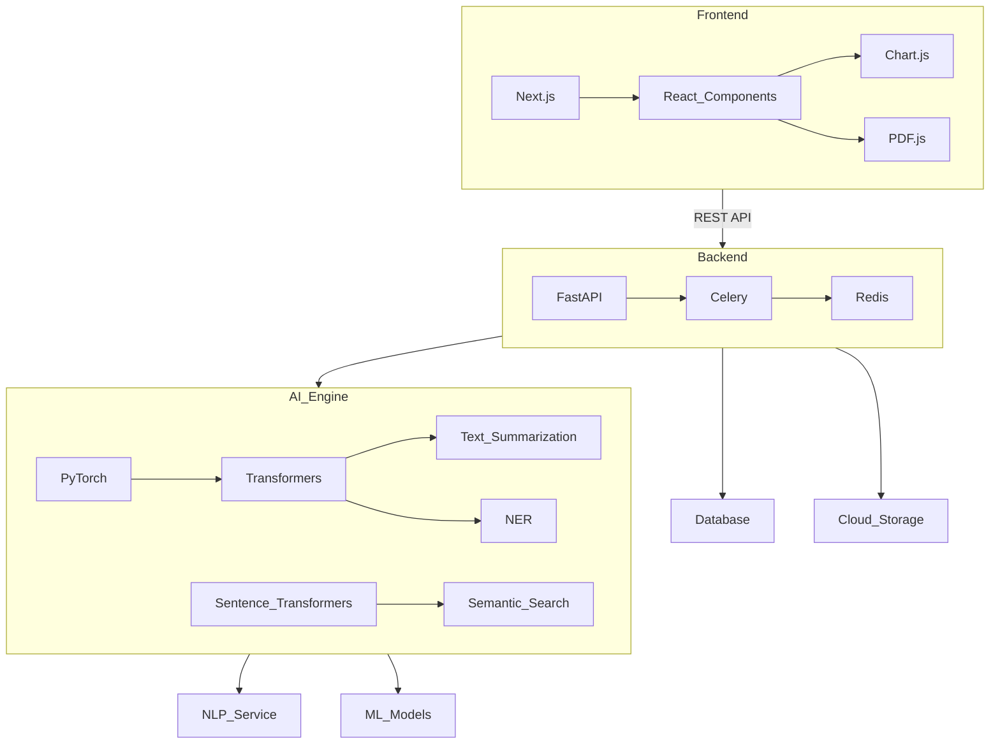
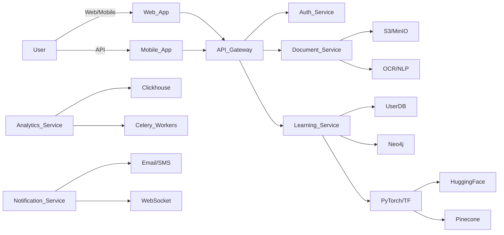

# 项目架构设计

以下是针对AI学习助手项目的详细拆解和技术方案：

### 系统模块分解
1. **文件管理模块**
- 多格式文档上传（PDF/DOCX/PPTX/TXT）
- 文档存储与版本控制
- 文档预处理（OCR/格式转换）

2. **内容分析模块**
- NLP处理引擎
- 知识概念提取
- 自动摘要生成
- 知识点关联图谱构建

3. **用户画像模块**
- 学习目标设定
- 知识水平评估
- 学习偏好收集
- 进度跟踪分析

4. **智能推荐模块**
- 个性化学习路径生成
- 知识盲点强化推荐
- 学习资源匹配
- 动态计划调整

5. **交互功能模块**
- 智能问答助手
- 交互式练习系统
- 学习反馈分析
- 成就激励体系

### 核心技术栈推荐


### 页面结构设计
```
Dashboard
├─ Personalized Plan
│  ├─ Progress Timeline
│  ├─ Daily Tasks
│  └─ Performance Metrics
├─ Document Center
│  ├─ Upload Panel
│  ├─ Annotated Materials
│  └─ Concept Map
├─ Learning Studio
│  ├─ Interactive Quizzes
│  ├─ AI Tutor Chat
│  └─ Note-taking Space
└─ Analytics
   ├─ Knowledge Mastery
   ├─ Time Allocation
   └─ Improvement Suggestions
```

### 核心接口设计
1. **文档处理接口**
- POST /api/v1/process-document
- 支持payload: multipart/form-data
- 返回结构：
```json
{
  "concept_map": [
    { "node": "Machine Learning", 
      "connections": ["Supervised Learning", "Neural Networks"],
      "importance": 0.92}
  ],
  "summary": "课程重点包括监督学习的基本原理...",
  "key_terms": ["梯度下降", "过拟合", "交叉验证"]
}
```

2. **学习计划生成接口**
- POST /api/v1/generate-plan
- 请求参数：
```json
{
  "learning_goals": ["掌握机器学习基础", "三个月内完成"],
  "time_commitment": 15,
  "knowledge_gaps": ["概率论", "线性代数"]
}
```
- 响应输出动态调整的学习日历和资源推荐

3. **知识点追溯接口** (WebSocket)
- 实时问答交互：
```javascript
socket.on('question', (question) => {
  const context = retrieveRelevantMaterial(question);
  const answer = generateAnswer(question, context);
  socket.emit('response', {
    answer: answer,
    reference: context.slice(0, 3),
    confidence: 0.87
  });
});
```

### 系统组件图


### 演进路线建议
1. 初期 MVP：
- 基础文档处理+固定模板学习计划
- 使用现有LLM API（OpenAI/Gemini）

2. 中期扩展：
- 自定义知识图谱构建
- 动态适应性学习算法
- 多模态学习支持（视频/音频）

3. 长期规划：
- 多人协作学习模式
- AR/VR沉浸式学习场景
- 多智能体教学系统

建议后续优先构建文档解析核心能力，采用RAG模式结合向量数据库实现精准内容检索，逐步通过用户反馈数据优化推荐算法。