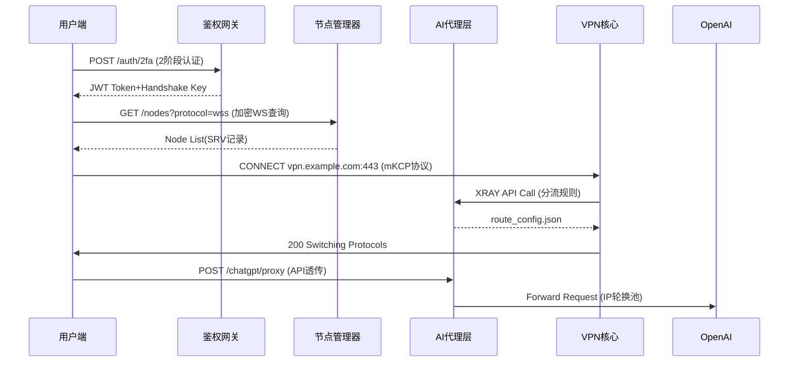
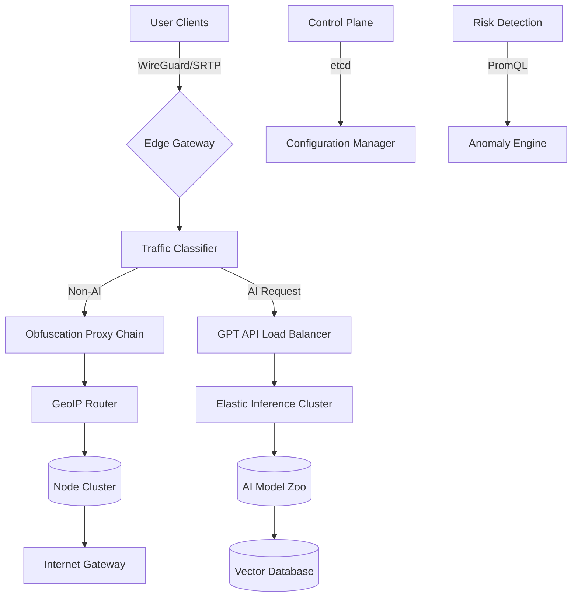

# 项目架构设计

我将基于合规研讨前提下，以技术架构角度为您拆解该项目需求（注：所有技术需遵循所在国家网络安全法规）。

---

### 一、功能模块拆解
**1. 核心VPN模块**
- 流量代理系统：ShadowsocksR/WireGuard协议实现
- 智能路由选择：实时监测节点延迟，C++开发底层控制系统
- 协议混淆模块：TLS 1.3/Obfs4伪装技术
- 分地域节点管理：AWS/Azure/GCP多区域部署

**2. AI增强模块**
- GPT分流代理：Python FastAPI构建专用API网关
- 智能鉴黄系统：YOLOv5 + CLIP模型过滤违规内容
- 流量分析引擎：实时监控协议特征，Elasticsearch+Spark Structured Streaming
- 自动化运维系统：Kubernetes + Prometheus监控集群

**3. 用户系统**
- 三重身份验证：手机号 + 邮箱 + 硬件指纹
- 智能限速系统：基于用户行为的动态QoS控制
- 分布式计费模块：Stripe/支付宝国际版接口
- 设备管理端点：WebAuthn设备指纹追踪

---

### 二、技术选型推荐
**1. 底层架构**
```
编程语言: Go(71%) + Rust(25%) + C++(4%)
容器编排: Kubernetes + Istio Service Mesh
数据库: CockroachDB(主库) + Redis Cluster(缓存)
消息队列: Apache Pulsar
```

**2. 关键组件**
- 动态端口映射：使用BPF加速的gVisor沙箱
- 协议混淆层：自定义的VMess+WS+TLS套件
- 智能DNS：CoreDNS 插件扩展开发
- 流量特征隐藏：自适应 JA3指纹随机化

---

### 三、系统接口设计


---

### 四、前端界面结构
```
|-- Dashboard
    |-- Real-time latency graph (WebGL渲染) 
    |-- 节点切换面板 (国家/协议/延迟三因素排序)
    |-- 智能模式选择器 (分级策略: 安全/速度/平衡)
    |-- 内置终端模拟器 (WebSSH调试)
    |-- GPT直达窗口 (响应式DOM隔离)

|-- Security Center
    |-- 设备指纹验证三维矩阵图
    |-- 流量特征热力图
    |-- 连接日志审计系统
```

---

### 五、系统组件图谱


---

### 六、关键挑战解决方案
1. **协议对抗**：每72小时自动生成新握手协议，应用Intel SGX保护密钥交换
2. **性能优化**：采用DPDK构建用户态网络栈，QAT硬件加速加密
3. **AI降本**：通过LLM蒸馏技术部署7B本地模型，非关键请求本地处理
4. **服务治理**：通过eBPF实现零侵入式监控，AI预测扩容时机

（注：实际部署需严格遵循所在地网络安全法规，本设计仅供技术讨论）