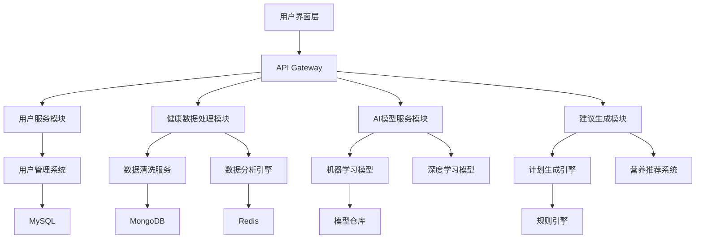

# 项目架构设计

我将为您拆解这个系统的架构设计，分为以下几个部分：

1. 系统模块拆解
2. 技术栈推荐
3. 核心组件交互图
4. 页面结构设计
5. API接口设计

### 一、系统模块拆解




### 二、推荐技术栈

|| 模块 | 技术方案 |
|---|-------|----------|
| 1 | 前端框架 | React + TypeScript + Next.js |
| 2 | 移动端 | Flutter（跨平台支持） |
| 3 | 后端框架 | Python(FastAPI) + Node.js |
| 4 | AI框架 | TensorFlow/PyTorch + Scikit-learn |
| 5 | 数据库 | PostgreSQL(结构化) + MongoDB(非结构) |
| 6 | 数据分析 | Pandas + NumPy + Jupyter |
| 7 | 消息队列 | RabbitMQ/Kafka |
| 8 | 容器化 | Docker + Kubernetes |
| 9 | 云服务 | AWS/Aliyun（医疗合规版） |
|10 | 安全框架 | OAuth2.0 + JWT + HIPAA合规 |

### 三、核心页面结构

1. 用户看板：
   - 健康指标可视化（折线图/热力图）
   - 当日建议卡片流
   - 计划进度环形图
   - 紧急提醒浮层

2. 数据上传中心：
   - 多格式上传入口（CSV/JSON/直接设备对接）
   - 数据映射配置器
   - 历史数据版本控制

3. 计划生成器：
   - 三维参数调节面板（强度/频率/持续时间）
   - 虚拟人体模型互动
   - 多方案对比视图

4. AI咨询中心：
   - 自然语言问答界面
   - 健康报告生成器
   - 进度预测模拟器

### 四、核心API设计（示例）

```markdown
1. 用户数据接口：
   POST /api/v1/data/upload
   - 支持multipart/form-data
   - 自动识别数据类型（Apple Health/Google Fit等）

2. AI分析接口：
   POST /api/v1/analysis/predict
   Request Body:
   {
       "user_id": "UUID",
       "metrics": ["heart_rate", "sleep_quality"],
       "time_range": "7d"
   }

3. 计划生成接口：
   POST /api/v1/plans/generate
   Response:
   {
       "workout_plan": {
           "daily_routine": [
               { "exercise": "Interval Running", 
                 "intensity": 0.75,
                 "duration": 30 }
           ],
           "nutrition": {
               "caloric_intake": 2200,
               "macro_balance": {...}
           }
       }
   }

4. 实时监控接口：
   Websocket /ws/v1/realtime
   推送频率：每15秒更新
   数据类型：心率变异率、血氧饱和度等
```

### 五、关键技术实现建议

1. 数据处理管道：
   - 建立ETL(Extract-Transform-Load)流水线
   - 实现自动数据清洗规则引擎
   - 开发数据质量监控仪表盘

2. AI模型架构：
   - 双模型协同架构：
     * 基础模型（LSTM时序预测）
     * 决策模型（强化学习策略网络）
   - 个性化增量学习机制
   - 可解释性AI模块（SHAP值分析）

3. 安全合规设计：
   - 医疗数据加密存储（AES-256）
   - 匿名化处理引擎
   - 审计追踪系统
   - GDPR/HIPAA合规流程

4. 性能优化：
   - 分布式模型推理集群
   - 预测结果缓存机制
   - 边缘计算支持（智能设备端计算）

需要特别关注医疗健康数据的合规性和隐私保护，建议使用经过医疗认证的云服务供应商，并在架构设计阶段就加入隐私计算（Privacy Computing）模块。对于AI模型部分，可结合传统医学知识和深度学习模型实现更可靠的输出结果。