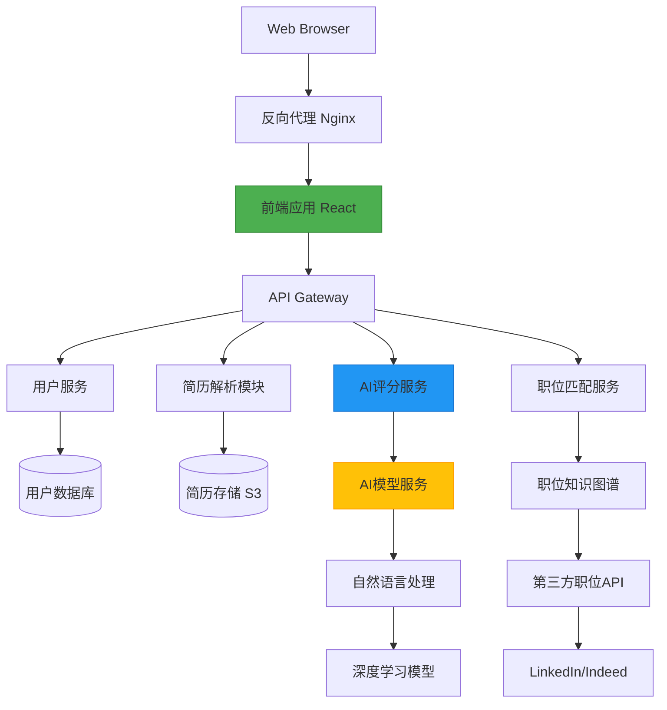

# 项目架构设计

我会将系统拆解为以下模块并进行技术选型，然后给出详细设计：

一、系统模块拆解
1. 用户管理模块（User Management）
2. 简历解析模块（Resume Parser）
3. AI评分模块（AI Scoring）
4. 优化建议引擎（Optimization Engine）
5. 职位匹配分析（Job Matching）
6. 可视化模块（Visualization）
7. 数据存储模块（Data Storage）

二、技术选型建议
🛠 服务架构：
- 前端：React + TypeScript + D3.js（图表）
- 后端：Python FastAPI
- AI框架：PyTorch/Hugging Face Transformers
- 数据库：PostgreSQL + Elasticsearch（文本搜索）
- 数据处理：SpaCy（NLP处理）
- 云服务：AWS S3（简历存储）
- 任务队列：Celery + Redis

三、页面结构与接口设计

1. 核心页面结构：
```
├─ 用户注册/登录
├─ 主看板（Dashboard）
│  ├─ 简历上传区
│  ├─ 实时评分显示
│  ├─ 匹配度雷达图
│  └─ 优化建议列表
├─ 简历详情分析
│  ├─ 技能匹配分布图
│  ├─ 时间线视图（工作经历）
│  └─ 竞争力对比图
└─ 职位市场洞察
   ├─ 行业匹配热力图
   └─ 岗位匹配网络图
```

2. 核心接口设计：
```python
# 用户服务
POST /api/v1/register
POST /api/v1/login

# 简历处理
POST /api/v1/upload-resume
GET /api/v1/resume/{id}/analysis

# AI功能
POST /api/v1/score-resume
POST /api/v1/generate-suggestions
GET /api/v1/job-match-graph
```

四、系统架构图（Mermaid）



五、详细说明

1. 核心模块职责：
- 简历解析模块：支持PDF/Word解析，使用PyPDF2和python-docx提取文本，通过SpaCy进行NER（命名实体识别）
- AI评分模型：基于Transformer的层次化注意力网络，评估：
  - 内容完整性（30%）
  - 关键词匹配度（25%）
  - 结构专业性（20%）
  - 竞争力指数（25%）
- 优化建议引擎：规则引擎（20%） + GPT模型生成（80%）
- 职位匹配图算法：基于Skill2vec（技能向量）和Graph Neural Networks构建关系图

2. 智能功能扩展点：
- 简历版本控制（Git式差异对比）
- 多岗位平行对比视图
- A/B测试建议方案
- 行业趋势关联分析

3. 安全考虑：
- 数据加密：简历存储使用AES-256加密
- GDPR合规处理：匿名化数据用于模型训练
- 访问控制：RBAC（基于角色的访问控制）

需要特别注意简历解析的容错处理（非结构数据转换）和AI模型的可解释性，建议初期采用混合模式（规则引擎+ML）保证建议的可靠性。为了提升用户体验，可以增加简历修改实时预览功能（类似Grammarly的交互方式）。