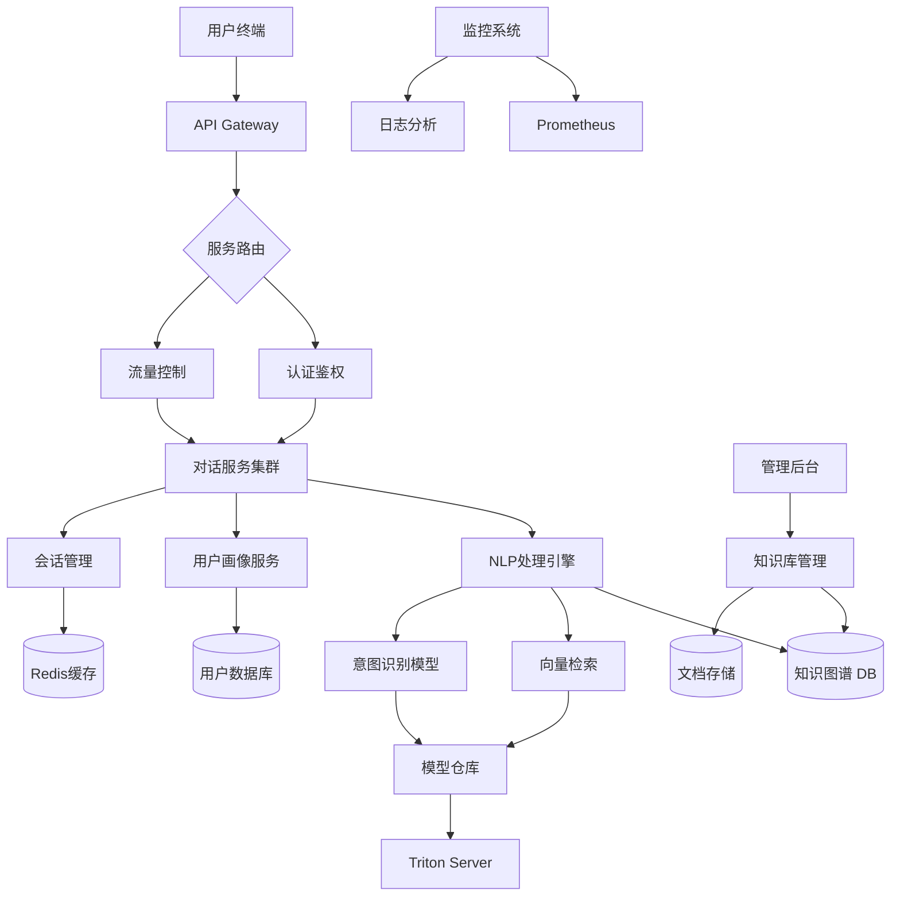

# 项目架构设计

以下是从需求拆解到系统设计的完整方案，采用模块化分层架构设计：

一、系统模块划分
1. 用户交互层（Web/Mobile）
   - FAQ界面模块
   - 即时对话模块
   - 用户档案管理
   - 反馈收集模块

2. 智能服务层
   - NLP处理引擎
   - 对话管理
   - 个性化推荐
   - 上下文理解

3. 数据层
   - 知识图谱数据库
   - 用户交互日志
   - 个性化模型库
   - 多模态资源库

4. 运营管理层
   - 知识库管理系统
   - 模型训练平台
   - 数据分析仪表盘
   - 系统监控中心

二、核心技术栈推荐
```markdown
# 核心组件                            推荐技术
前端框架:          React + Ant Design + Socket.IO
后端服务:          FastAPI + Celery + Redis
对话引擎:          Rasa 3.x + Transformer (BERT/GPT-3.5)
知识图谱:          Neo4j + Apache Jena
向量检索:          FAISS + Sentence-Transformers
数据分析:          Apache Spark + Tableau
模型服务:          Triton Inference Server
基础架构:          Docker + Kubernetes + AWS/GCP
监控日志:          Prometheus + Grafana + ELK Stack
```

三、核心接口设计示例
1. 对话接口
```python
POST /api/v1/chat
Request:
{
  "user_id": "uuid",
  "message": "退货政策是什么？",
  "context": {"conversation_id": "cid123"},
  "device_info": { ... }
}

Response:
{
  "response": "我们的退货政策是...",
  "suggested_actions": ["查看详细条款", "联系人工客服"],
  "confidence": 0.92,
  "context_update": {...}
}
```

2. 知识库同步接口
```python
POST /api/v1/knowledge/sync
Request:
{
  "operation": "update",
  "entity_type": "退货政策",
  "content": {"new_policy": "..."},
  "effective_date": "2024-03-01"
}
```

3. 用户画像接口
```python
GET /api/v1/user/profile/<user_id>
Response:
{
  "preferences": {
    "language": "zh-CN",
    "preferred_channels": ["chat"]
  },
  "interaction_history": [
    {
      "timestamp": "2023-08-20T14:30:00",
      "intent": "退货咨询",
      "sentiment": 0.85
    }
  ]
}
```

四、系统架构图 (Mermaid)


五、关键流程说明
1. 对话处理流程：
   - 用户输入通过WebSocket连接进入API Gateway
   - 经过身份验证后路由到对话服务
   - 上下文管理器检查对话历史
   - NLP引擎进行：意图识别 -> 实体提取 -> 知识检索
   - 个性化模块结合用户画像生成最终回复

2. 知识更新流程：
   - 管理后台提交结构化/非结构化知识
   - 知识抽取引擎自动构建知识图谱
   - 语义索引模块刷新向量数据库
   - 版本控制模块保持服务一致性

3. 异常处理机制：
   - 降级策略：根据不同服务模块的健康度自动切换流程
   - 熔断机制：设置PQD（每秒查询次数）阈值自动限流
   - 轨迹追踪：通过X-Request-ID关联全链路日志

六、演进路线建议
1. 基础阶段（MVP）：
   - 实现核心FAQ回复功能
   - 集成基础NLU模型
   - 搭建简单知识库系统

2. 进阶阶段：
   - 引入用户画像系统
   - 增加多轮对话管理
   - 实现跨渠道状态同步

3. 成熟阶段：
   - 构建自学习知识图谱
   - 部署预测性服务推荐
   - 增加语音交互能力

4. 智能优化：
   - 引入强化学习优化对话策略
   - 实现自动服务升级闭环
   - 建立客户情感分析预警系统

需特别关注数据安全合规性，建议采用Differential Privacy技术处理用户数据，并通过可视化审计工具确保算法透明性。