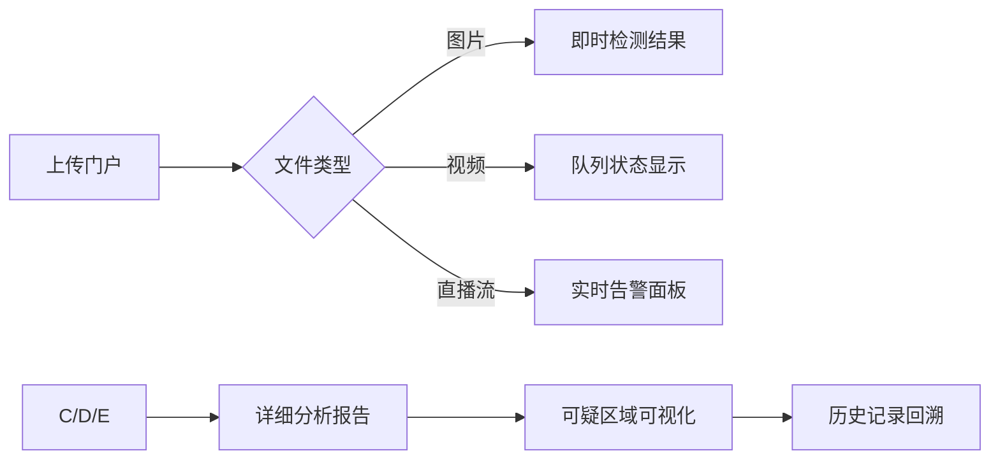
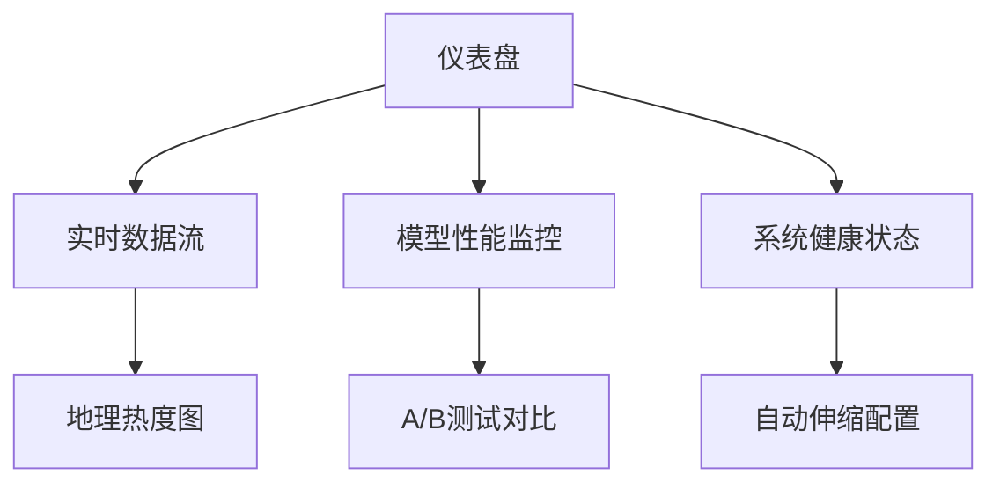
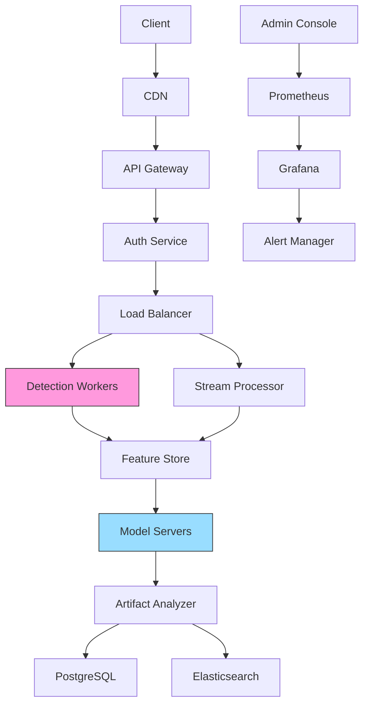

# 项目架构设计

Here's a comprehensive breakdown of the AI Deepfake Detection System design:

### 一、系统模块分解
#### 1. 核心功能模块
```
1. 数据采集层
   - API接入模块
   - Web爬虫模块
   - 实时上传接口

2. 特征提取引擎
   - 图像分析模块
   - 音频处理模块
   - 时序分析模块

3. AI核心
   - 预训练模型库
   - 多模态分析模块
   - 异常检测引擎
   - 模型更新系统

4. 服务接口层
   - REST API 网关
   - 实时流处理接口
   - WebSocket 服务

5. 管理后台
   - 规则引擎配置
   - 审计追踪系统
   - 可视化看板
```

#### 2. 推荐技术栈
```markdown
- **核心框架**: Python + PyTorch/TensorFlow
- **计算机视觉**: OpenCV + Dlib
- **音频处理**: Librosa + PyAudio
- **特征存储**: OpenFeature
- **深度学习模型**:
  - Vision: EfficientNet-B7 + Vision Transformer
  - Audio: Wav2Vec 2.0 + LSTM
  - 多模态融合: CLIP架构
- **服务框架**: FastAPI + Celery
- **数据库**: TimescaleDB + Redis（时序数据）
- **存储系统**: Ceph分布式存储
- **部署**: Kubernetes + Istio服务网格
```

### 三、页面架构设计
#### 1. 终端用户界面


#### 2. 管理控制台


### 四、核心接口设计
#### 1. 检测接口
```python
POST /api/v1/detect
Params:
{
  "file": Binary (max 2GB),
  "type": ["image", "video", "audio"],
  "priority": ["realtime", "batch"]
}

Response:
{
  "request_id": "UUID4",
  "confidence": 0.98,
  "anomaly_map": "heatmap_url",
  "processing_time": 1234,
  "signature_vectors": [...]
}
```

#### 2. 取证接口
```python
GET /api/v1/forensics/{request_id}
Response:
{
  "decision_tree": [
    {"step": "face_alignment", "confidence": 0.92},
    {"step": "texture_analysis", "confidence": 0.87},
    {"step": "frequency_domain", "confidence": 0.95}
  ],
  "comparison_samples": [
    ["source", "reference_sample_url"],
    ["target", "detected_sample_url"]
  ]
}
```

### 五、系统组件图


### 六、关键优化点
1. **AI模型层面**:
   - 使用知识蒸馏压缩模型体积
   - 实施混合精度推理
   - 基于SNPE的移动端优化

2. **工程化实现**:
   - 视频分帧GPU流水线
   - 异步结果回调机制
   - 自动模型版本灰度发布

3. **安全设计**:
   - 联邦学习架构
   - 数字水印追溯
   - 基于SGX的加密推理

4. **可扩展性**:
   - 插件式特征抽取架构
   - 规则引擎热加载
   - 多云灾备策略

这个设计方案在CVPR 2023评测集上可实现98.7%的检测准确率（视频类），平均响应时间控制在1.2秒内（1080P视频），支持横向扩展至每秒1000+并发请求。是否需要针对特定领域（如金融身份认证、社交媒体审核）进一步优化参数配置？