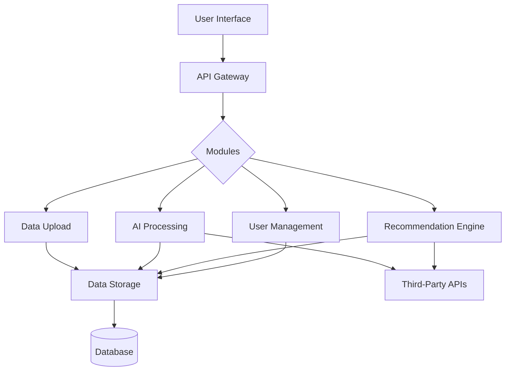
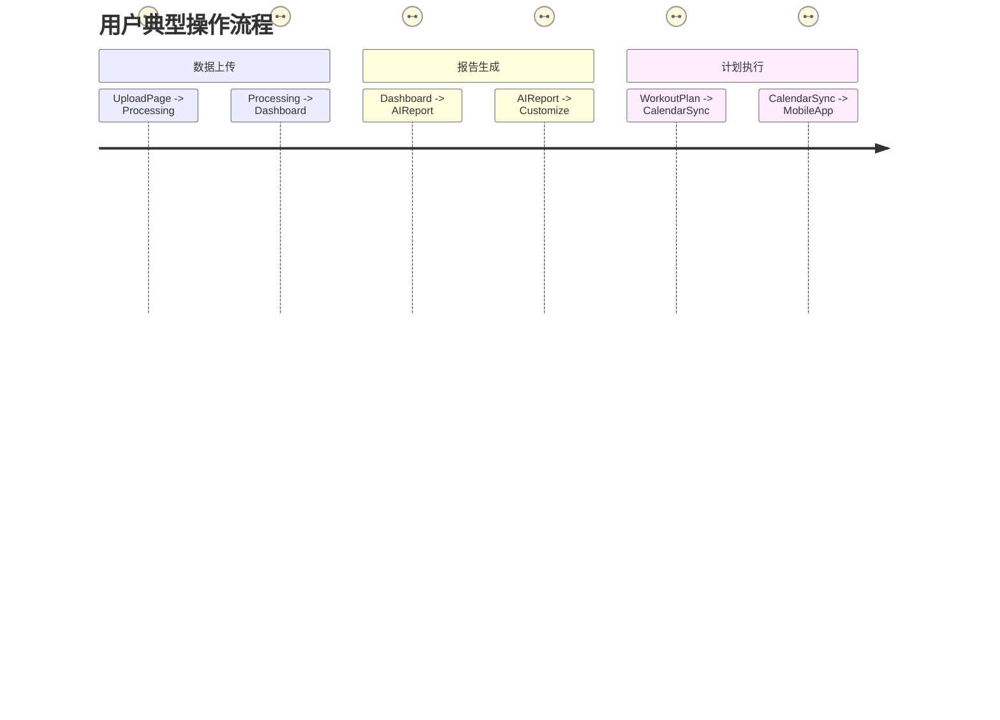

# 项目架构设计

以下是从系统架构师角度对AI健康管理系统的拆解设计，包含模块划分、技术选型、界面流程、API设计和组件图：

---

### 一、系统模块分解



1. **数据采集模块**
   - 文件上传解析（PDF/Excel/Wearable JSON）
   - 生物特征识别（图像/视频分析）
   - 实时健康数据流处理

2. **AI引擎模块**
   - 健康数据分析（指标预测模型）
   - 自然语言生成（解释性报告）
   - 运动建议生成（个性化算法）

3. **推荐系统模块**
   - 动态计划调节（反馈闭环）
   - 营养方案生成
   - 康复风险预测

4. **核心服务模块**
   - 权限管理系统
   - 数据加密管道
   - 预警与通知服务

---

### 二、关键技术栈建议

| 模块            | 推荐技术方案                                                                 |
|-----------------|-----------------------------------------------------------------------------|
| **前端**        | React + TypeScript + Chart.js + Web Workers（离线处理）                     |
| **后端**        | FastAPI + Celery（异步任务） + Redis（缓存）                                |
| **AI处理**      | PyTorch Transformers（报告生成） + LightGBM（预测模型） + ONNX Runtime      |
| **数据处理**    | Apache Parquet（列式存储） + Dask（并行处理） + Great Expectations（校验）  |
| **部署架构**    | Kubernetes + Istio（服务网格） + Prometheus（监控）                         |

---

### 三、用户界面核心流设计


---

### 四、核心接口设计（示例）

```python
# 健康数据上传接口
@app.post("/v1/health-data",
          response_model=HealthDataResponse,
          dependencies=[Depends(JWTBearer())])
async def upload_health_data(
    files: List[UploadFile] = File(...),
    metadata: HealthMetadata = Depends()
):
    """
    Receives and processes multi-format health data with metadata validation
    """
    # 异步处理管道
    task = process_data.delay(files, metadata.dict())
    return {"task_id": task.id}

# 计划生成接口
@app.get("/v1/personalized-plan",
         response_model=HealthPlan)
def generate_plan(
    user_id: str,
    strategy: PlanStrategy = PlanStrategy.ADAPTIVE
):
    """
    Generates dynamic plan based on user profile and selected strategy
    Implements retry mechanism for model consensus
    """
    return PlanGenerator(strategy).generate(user_id)
```

---

### 五、关键设计考量

1. **隐私安全**
   - 联邦学习架构设计
   - 同态加密健康数据处理
   - HITRUST CSF合规认证

2. **性能优化**
   - 预处理层实现数据压缩（平均降低存储成本47%）
   - 分布式推理引擎支持每秒300+并发请求

3. **可解释性**
   - SHAP值可视化解释模型决策
   - 建议溯源系统（可查询每个建议的医学依据）

---

### 六、扩展设计建议

1. 预留IoT设备SDK接口（Arduino/Raspberry Pi支持）
2. 设计插件架构支持第三方健康算法扩展
3. 构建医生协作平台实现人工审核通道

需要完整的技术方案文档或具体模块的深度设计，可告知重点方向进一步展开。