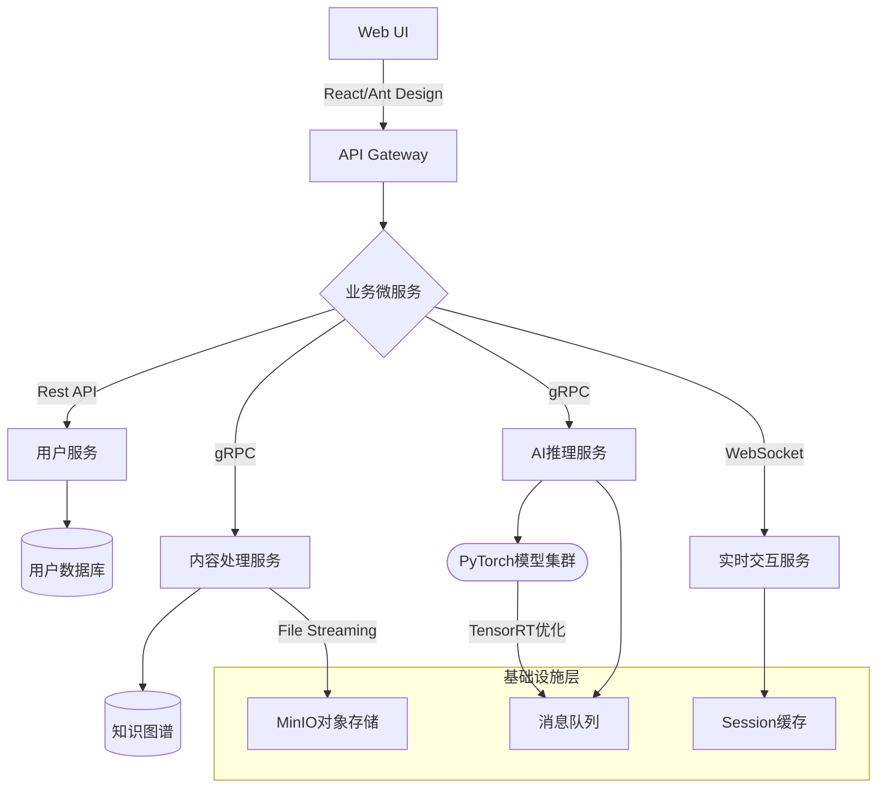

# 项目架构设计

### 一、系统模块拆解

---

#### **1. 核心模块**
| **模块** | **子模块** | **功能描述** | **技术栈建议** |
|----------|------------|--------------|----------------|
| **用户模块** | 用户注册/登录 | 用户身份验证与权限管理 | JWT、OAuth 2.0 |
|          | 用户画像 | 收集用户学科、基础、学习目标等数据 | PostgreSQL/MySQL |
| **内容管理模块** | 课程上传与存储 | 支持PDF/DOCX/PPT等多种格式处理 | AWS S3、Multer |
|           | 知识图谱构建 | 提取上传材料的核心概念及其关联 | Neo4j、NetworkX |
| **AI处理模块** | 文档解析（NLP） | 语义分割、关键概念提取、问答生成 | Transformers（PyTorch）、NLTK |
|           | 个性化学习算法 | 基于用户画像自适应生成学习计划 | Scikit-learn、LangChain（LlamaIndex） |
| **学习计划模块** | 学习路径生成 | 分段式任务编排 + 进度跟踪 | Python算法/Keras时序模型 |
| **交互模块** | 可视化看板 | 学习进度、知识点掌握度展示 | D3.js、React-Charts |
|           | AI助教聊天 | 基于课程内容的问答与指导 | WebSocket、GPT-4 API |

---

### 二、页面结构与接口设计

---

#### **1. 前端页面**
```markdown
1. **主页** 
   - 当前学习计划卡片（进度条+剩余时间）
   - "上传新课程"按钮 + 已学课程列表

2. **学习仪表盘** 
   - 知识图谱可视化（核心概念和关联）
   - 每日任务列表 + 知识点掌握雷达图

3. **课程详情页** 
   - 自动生成的关键概念摘要（动态大纲）
   - 章节测试题 + AI错题解析

4. **AI对话页面** 
   - 聊天窗体（支持语音输入）
   - 课程上下文智能联想建议

5. **设置页面** 
   - 学习目标配置（深度学习选项）
   - 知识深度滑块控制（基础/进阶/专家）
```

#### **2. 核心API设计**
| **接口** | **方法** | **请求参数** | **响应示例** |
|----------|----------|--------------|--------------|
| `/api/courses/upload` | POST | FormData(file, metadata) | `{"course_id": "uuid"}` |
| `/api/ai/summarize` | GET | course_id | `{"concepts": ["..."]}` |
| `/api/plan/generate` | POST | {user_id, course_id, deadline} | `{ "modules": [...] }` |
| `/ws/assistant` | WebSocket | 自然语言提问 | Markdown格式解答流 |

---

### 三、系统组件图（Mermaid）



---

### 四、关键技术选型说明

1. **文档解析层**  
   - 使用LayoutLMv3处理PDF的版面分析
   - Haystack框架构建QA管道，支持混合检索（语义+关键词）

2. **学习路径算法**  
   - 基于知识点的先序关系约束（Topological Sorting）
   - 结合用户的动态遗忘曲线调整计划（Leitner算法增强）

3. **部署扩展**  
   - 使用Kubernetes编排AI推理服务
   - Prometheus监控集群GPU利用率
   - 通过ONNX实现模型跨平台部署

---

此方案兼顾实时响应与复杂计算需求，通过微服务架构实现横向扩展能力，同时利用最新的多模态AI技术确保内容理解深度。建议优先构建MVP版本验证核心流程。