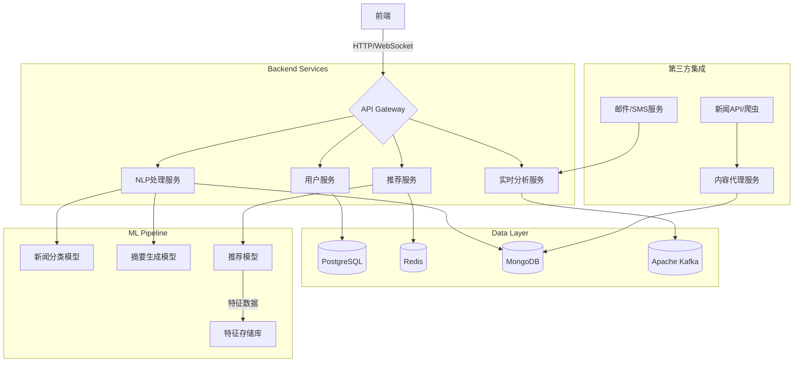

# 项目架构设计

以下是针对AI新闻推荐系统的模块拆解、技术选型、页面结构和接口设计，以及系统组件图：

---

### 一、系统模块拆解
| 模块             | 功能描述                                                                 |
|------------------|------------------------------------------------------------------------|
| 1. **用户管理**    | 用户注册/登录、兴趣标签设置与动态更新                                   |
| 2. **新闻获取**    | 聚合多来源新闻（API/爬虫）、去重与初步过滤                             |
| 3. **内容处理**    | 新闻分类/实体识别、摘要生成、关键词抽取                                |
| 4. **推荐算法**    | 用户兴趣建模、基于协同过滤/深度学习的推荐系统、实时行为反馈学习         |
| 5. **摘要生成**    | 基于LLM（如GPT）的个性化摘要生成，结合用户标签优化输出                 |
| 6. **推送服务**    | 定时推送（邮件/APP通知）、分级推送策略（紧急/常规）                    |
| 7. **数据分析**    | 用户行为埋点、推荐效果评估（CTR分析）、兴趣标签可视化                  |

---

### 二、技术选型推荐
| 领域              | 技术方案                                                                 |
|-------------------|--------------------------------------------------------------------------|
| **后端框架**       | FastAPI（异步支持）或 Django + DRF                                      |
| **数据库**         | PostgreSQL（用户数据） + MongoDB（非结构化新闻数据） + Redis（缓存）     |
| **NLP处理**        | spaCy（实体识别）、BERT/Transformers（文本表示）、GPT-3.5/GPT-4（摘要生成） |
| **推荐算法**       | Surprise（协同过滤）、LightFM（混合模型）、PyTorch/TensorFlow（深度模型） |
| **实时处理**       | Apache Kafka（行为日志流处理）、Apache Flink（实时特征计算）             |
| **前端技术**       | React + Redux + Ant Design / Vue3 + TypeScript                           |
| **部署运维**       | Docker + Kubernetes（容器化）、Prometheus + Grafana（监控）              |

---

### 三、页面结构设计
```text
1. 用户注册/登录页
   - 邮箱/第三方登录
   - 兴趣标签选择（初始注册时）

2. 首页（动态内容流）
   - 推荐新闻卡片式布局
      - 缩略图（可选）
      - AI生成摘要（3行核心内容）
      - 兴趣标签匹配提示
      - 收藏/分享/不感兴趣按钮

3. 兴趣管理侧边栏
   - 当前活跃标签展示
   - 新增/删除标签功能
   - 兴趣热度时间轴

4. 新闻详情页
   - 完整AI摘要（带高亮关键词）
   - 原文跳转链接
   - 相似推荐列表（基于当前内容）

5. 数据分析面板（管理员）
   - 用户活跃度热力图
   - 标签趋势词云
   - CTR漏斗分析
```

---

### 四、核心接口设计
```python
# 用户服务
POST /api/v1/auth/register       # 携带初始兴趣标签
GET  /api/v1/users/{user_id}/tags # 获取动态更新的兴趣标签
PUT  /api/v1/users/tags          # 用户标签动态调整

# 推荐服务
GET /api/v1/recommendations?user_id={id} # 返回推荐列表（带AI摘要）
POST /api/v1/feedback            # 收录用户的隐式反馈（阅读时长/点击行为）

# NLP处理服务
POST /api/v1/summarize           # 输入新闻内容，输出个性化摘要
GET  /api/v1/entities/{news_id}  # 获取新闻关键词和实体识别结果
```

---

### 五、系统架构图（Mermaid）


---

### 六、关键实现要点
1. **冷启动解决方案**  
   - 采用混合推荐策略：新用户先用基于内容推荐（TF-IDF + 热门标签匹配），后逐步切换为协同过滤

2. **摘要个性化控制**  
   - 将用户标签作为prompt输入给LLM：  
     *"生成一段包含[科技, 人工智能]相关信息的摘要，不超过150字..."*

3. **实时反馈闭环**  
   设计阶段需包含埋点系统，记录：
   - 曝光日志（用户看到的内容）
   - 点击/阅读时长
   - 显式评分（收藏/不感兴趣）

4. **性能优化方向**  
   - 新闻向量预计算（使用BERT预处理文本向量）
   - 定期刷新推荐缓存（根据用户活跃模式调整刷新频率）

---

是否需要针对推荐算法架构或具体模块的扩展说明？