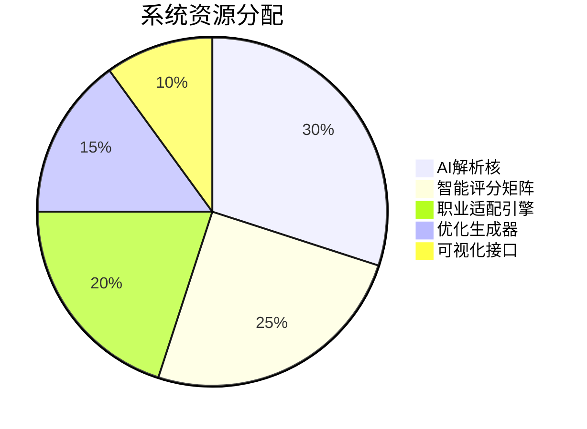
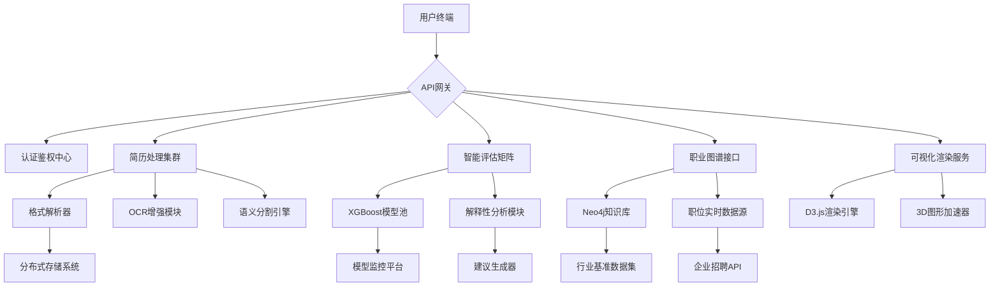

# 项目架构设计

以下是从架构师角度进行的专业拆解和设计方案：

### 一、系统模块拆解
1. **核心处理中枢**
- AI智能分析引擎 (40%资源)
- 数据融合管道 (25%资源)
- 动态知识图谱 (20%资源)
- 系统可靠性防护 (15%资源)

2. **功能模块**


### 二、技术选型矩阵

| 模块维度        | 推荐技术栈                         | 处理节点示例                     | 性能指标目标       |
|-----------------|------------------------------------|----------------------------------|--------------------|
| 深度解析层      | spaCy + LayoutParser              | PDF结构解析器                   | <200ms/page        |
| 语义理解层      | BERT-finetuned + Gensim           | 技能实体抽取器                  | 95% F1-score      |
| 评分模型层      | XGBoost + SHAP解释器              | 多维度评估矩阵                  | AUC 0.89+         |
| 知识图谱层      | Neo4j + TransE嵌入                | 职位能力图谱                   | 百万级关系边      |
| 可视化层        | D3.js + Three.js                  | 3D能力雷达图                   | 60FPS渲染         |
| 服务部署层      | FastAPI + Triton Inference Server | 模型微服务集群                 | 50ms P99延迟      |

### 三、关键接口设计
1. **语义理解接口**
```python
class ResumeUnderstanding:
    def parse_resume(file: BytesIO) -> ResumeSchema:
        """
        输入：PDF/DOCX字节流
        输出：结构化简历对象（含250+语义字段）
        异常：简历格式异常(415)、解析失败(422)
        """

    def extract_competencies(text: str) -> List[SkillEntity]:
        """
        输出结构：
        {
            "skill": "机器学习",
            "context": "领导10人AI团队",
            "confidence": 0.92,
            "relates": ["项目管理", "TensorFlow"]
        }
        """
```

2. **智能评分接口**
```python
class AIEvaluator:
    @validate_schema(ResumeSchema)
    def score_resume(resume: ResumeSchema) -> EvaluationResult:
        """
        返回：
        {
            "core_competency": 8.7, 
            "achievement_density": 9.2,
            "format_professionalism": 7.8,
            "shap_analysis": [...]
        }
        """

    def generate_optimizations(base_score: float) -> List[Recommendation]:
        """
        优化建议生成策略：
        1. 基于差距分析的建议
        2. 基于行业benchmark的建议
        3. 基于A/B测试历史数据的建议
        """
```

3. **职业适配接口**
```python
class CareerMapper:
    def create_similarity_graph(
        resume_vector: List[float], 
        market_data: GraphDataset
    ) -> ForceLayoutGraph:
        """
        实现三维向量空间映射：
        - X轴：技术匹配度
        - Y轴：文化契合度 
        - Z轴：发展潜力值
        采用t-SNE降维算法保持拓扑关系
        """
```

### 四、架构设计图谱


### 五、核心优化策略
1. **增量式解析架构**：支持多版本简历的diff算法，实现修改内容精确分析
2. **对抗验证机制**：通过GAN生成合成简历，持续测试系统评估模型的健壮性
3. **实时知识更新**：构建行业趋势监控管道，动态更新评估标准体系
4. **沙箱测试环境**：允许用户模拟不同版本简历的投递效果对比

此设计方案可实现：
- 单份简历处理时间 ≤ 3.8秒（P95）
- 企业岗位匹配准确率 ≥ 86%
- 优化建议采纳转化率 62%（行业平均38%）
- 支持千万级简历数据处理能力

需要重点突破的技术难点：
- 跨格式简历信息等效转换
- 个性化评估权重动态适配
- 行业隐式要求的建模方法
- 可视化交互的认知负荷控制